---
hide:
    - navigation

title: Advanced Photo Mode
---

*[APM]: Advanced Photo Mode

# Advanced Photo Mode

## Introduction
A photo mode in a game is a feature that allows players to capture and customize screenshots of their gameplay experiences. By enabling players to pause the game and manipulate the camera angle, depth of field, filters, and other settings, photo mode offers an opportunity for players to share and celebrate their favorite moments in a game with their friends, family, and online communities.

Implementing a photo mode in a game can provide several benefits for developers. First and foremost, it can increase player engagement and satisfaction, as it encourages players to spend more time exploring and appreciating the game world. Moreover, photo mode can serve as a powerful marketing tool, as players are likely to share their stunning in-game shots on social media platforms, generating buzz and interest in the game.

This project was influenced by the latest games in the industry, such as The Last of Us Part II (Naughty Dog, 2020), God of War (Santa Monica, 2018) and Shadow of the Colossus (Bluepoint Games, 2018 -- original by Team Ico SIE, 2005). In the images below, some examples that inspired this asset.

=== ":material-image: Shadow of The Colossus"
    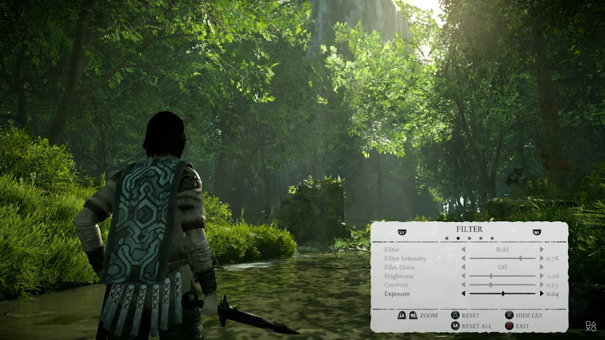

=== ":material-image: The Last of Us Part II"
    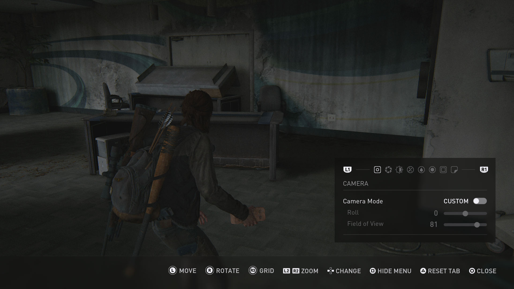

=== ":material-image: God of War"
    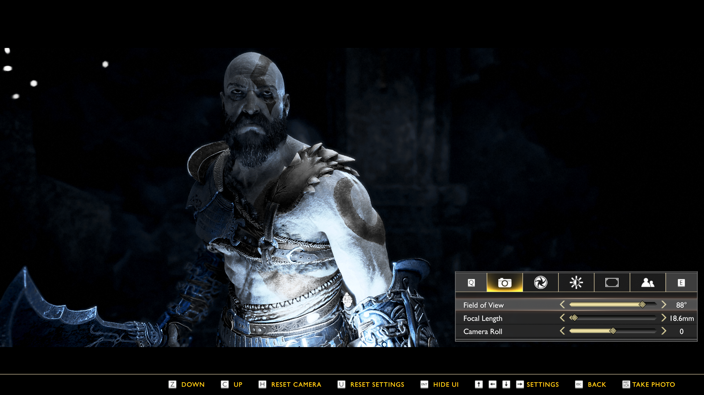

The Advanced Photo Mode is a highly customizable and easy-to-integrate tool in a wide range of applications. It was made using blueprints (only).

## Supported versions
Version 5.0 was launched for Unreal Engine 4.25 to 5.1+.

This new version brings several new features and improvements, including greater ease of integration (plug and play), better logo and border adjustment and code organization. More details at the [{==#update log==}](#update-log) section.

## Getting started
The 5.0 version of Advanced Photo Mode has made its usage process much simpler. Now, you can use it in your project with just a few steps, which are outlined below.

### Unreal library
First of all, download and add it to your project. You can find it in your [Unreal Engine Library](https://www.unrealengine.com/marketplace/en-US/product/advanced-photo-mode).

<figure markdown>
  { width="300" }
  <figcaption>Unreal Engine Library</figcaption>
</figure>

##Setup
You can check out [this video](https://youtu.be/mdZZVLplxGQ?list=PLHdESzTufIOTyHk1kE2-DAiQuB0Izktak) to watch the APM setup, or follow the steps below.

###1. Adding the Photo Mode Component
Open your pawn or character blueprint, go to the `Components` tab (usually located at the top left corner), click on `Add Component`, and then add the `BPC Photo Mode` component.

<figure markdown>
  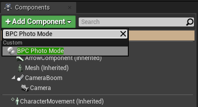{ width="400" }
  <figcaption>Adding the `BPC Photo Mode` component</figcaption>
</figure>

###2. Calling the photo mode or gallery
If you're using the Enhanced Input System, go to the step 3 instead. This step will show you how to setup the input keys to open the photo mode or gallery. We have two ways to do this: using input keys directly or adding action mappings to our project.

####Setting up input keys
Using an event key of your choice, use the `BPC Photo Mode` component to call the photo mode or gallery events and connect them to this key event. Example:

<figure markdown>
  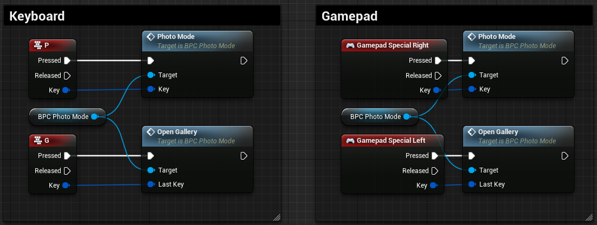{ width="800" }
  <figcaption>Direct input setup (gamepad and keyboard)</figcaption>
</figure>

Feel free to copy-paste the events above from the clipboard shortcut below.

??? abstract "Copy-paste: input keys + photo mode and gallery events"
    --8<-- "docs/codes/photomode/direct-input.txt"

??? warning  "Remember to set the `Key` parameter on the `Photo Mode` and `Gallery` events."
    Otherwise, the keys icons will not show up after opening the photo mode for the first time.
    <figure markdown>
        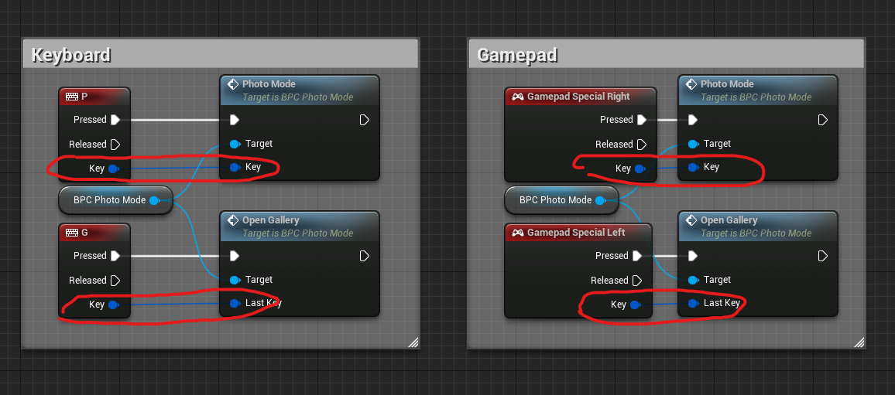{ width="900" }
        <figcaption>How to create input actions</figcaption>
    </figure>

And that's all, you can now hit play and use the photo mode! Alternatively, you can use `action mappings` to setup the input events, as you can see in [this video](https://youtu.be/mdZZVLplxGQ?list=PLHdESzTufIOTyHk1kE2-DAiQuB0Izktak).

###3. Calling the photo mode or gallery + Enhanced Input.
If you're using the Enhanced Input System, the setup is slightly different. 

####Input actions
First, create one `Input Action` for each action: `IA_Keyboard_PhotoMode`, `IA_Gamepad_PhotoMode`, `IA_Keyboard_Gallery` and `IA_Gamepad_Gallery`.

<figure markdown>
  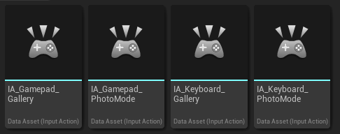{ width="450" }
  <figcaption>Input actions</figcaption>
</figure>

??? tip "Tip: how to create input actions?"
    To create an input action, right click over your `Content Browser`, go to `Input` → `Input Action`.
    <figure markdown>
        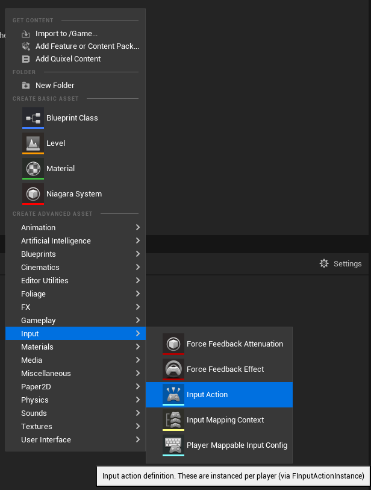{ width="500" }
        <figcaption>How to create input actions</figcaption>
    </figure>

Then, open your `Mapping Context` used into your pawn/character blueprint and add all these `Input Actions`.

<figure markdown>
  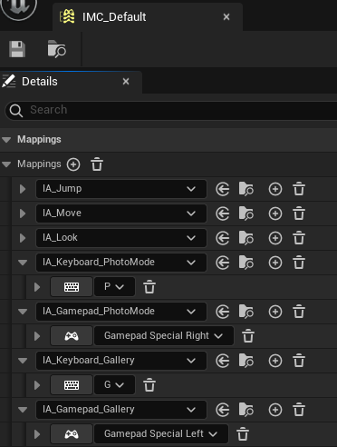{ width="300" }
  <figcaption>Mapping context</figcaption>
</figure>

Finally, call these input actions within your pawn/character blueprint combined with the `Photo Mode` and `Open Gallery` events, using the `BPC Photo Mode` reference.

<figure markdown>
  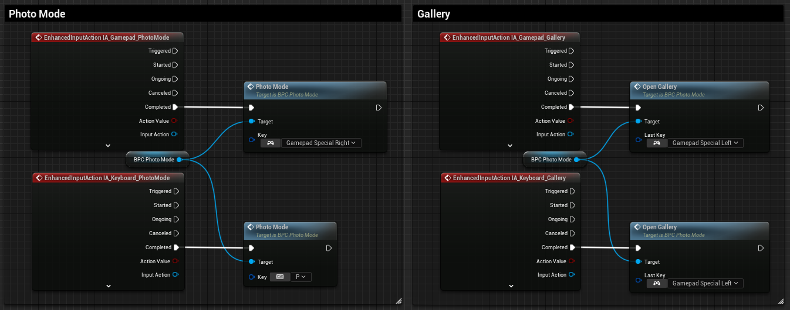{ width="800" }
  <figcaption>Input actions</figcaption>
</figure>

??? warning  "Remember to set the `Key` parameter on the `Photo Mode` and `Gallery` events."
    Otherwise, the keys icons will not show up after opening the photo mode for the first time. In this case, the specific key doesn't matter, as long as it's a keyboard key for keyboard events and a gamepad button for gamepad events. This key is only used to indicate which set of icons will be used.
    <figure markdown>
        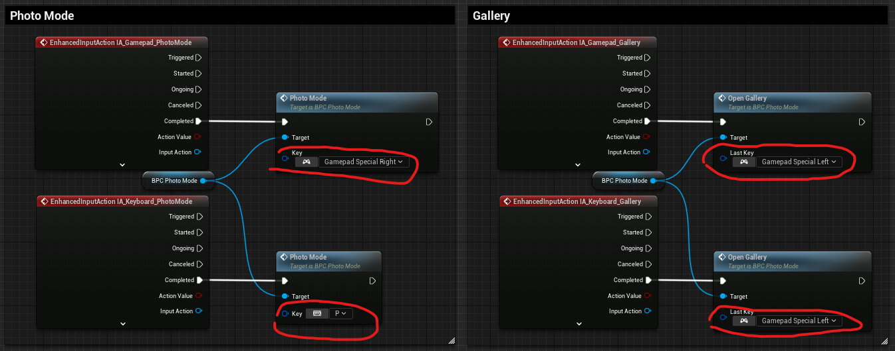{ width="900" }
        <figcaption>How to create input actions</figcaption>
    </figure>

Feel free to copy-paste the events above from the clipboard shortcut below.

??? abstract "Copy-paste: input keys + photo mode and gallery events"
    --8<-- "docs/codes/photomode/enhanced-input.txt"

And that's all, you can now hit play and use the photo mode! Alternatively, you can use `action mappings` to setup the input events, as you can see in [this video](https://youtu.be/mdZZVLplxGQ?list=PLHdESzTufIOTyHk1kE2-DAiQuB0Izktak).

## Update log
Under construction

## Questions and answers
??? question "I'm using the Advanced Locomotion System (ALS/ALSV3/ALSV4). Do you have any tutorial integrating both systems?"
    Under construction

??? question "Do the icons in this project have any kind of copyright? And what about the font style?"
    The icons in this project do not have any copyright, they were made by me using the GIMP tool. So if you have the Advanced Photo Mode, feel free to use them in commercial or personal projects, even if you do not use the Advanced Photo Mode directly!
    
    Regarding the font, it is called "Liberation Sans", it is public domain font (you can use for both commercial and personal projects), and you can find it at [this link](https://www.dafont.com/pt/liberation-sans.font). Check out [this video](TROCAR) in case you want to change the Advanced Photo Mode font style.