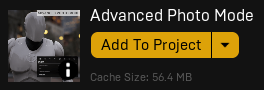

---
hide:
    - navigation

title: Advanced Photo Mode
---

*[APM]: Advanced Photo Mode

# Advanced Photo Mode

## Introduction
A photo mode in a game is a feature that allows players to capture and customize screenshots of their gameplay experiences. By enabling players to pause the game and manipulate the camera angle, depth of field, filters, and other settings, photo mode offers an opportunity for players to share and celebrate their favorite moments in a game with their friends, family, and online communities.

Implementing a photo mode in a game can provide several benefits for developers. First and foremost, it can increase player engagement and satisfaction, as it encourages players to spend more time exploring and appreciating the game world. Moreover, photo mode can serve as a powerful marketing tool, as players are likely to share their stunning in-game shots on social media platforms, generating buzz and interest in the game.

This project was influenced by the latest games in the industry, such as The Last of Us Part II (Naughty Dog, 2020), God of War (Santa Monica, 2018) and Shadow of the Colossus (Bluepoint Games, 2018 -- original by Team Ico SIE, 2005). In the images below, some examples that inspired this asset.

=== ":material-image: Shadow of The Colossus"
    

=== ":material-image: The Last of Us Part II"
    

=== ":material-image: God of War"
    

The Advanced Photo Mode is a highly customizable and easy-to-integrate tool in a wide range of applications. It was made using blueprints (only).

## Supported versions
Version 5.0 was launched for Unreal Engine 4.25 to 5.1+.

This new version brings several new features and improvements, including greater ease of integration (plug and play), better logo and border adjustment and code organization. More details at the [{==#update log==}](#update-log) section.

## Getting started
The 5.0 version of Advanced Photo Mode has made its usage process much simpler. Now, you can use it in your project with just a few steps, which are outlined below.

### Unreal library
First of all, download and add it to your project. You can find it in your [Unreal Engine Library](https://www.unrealengine.com/marketplace/en-US/product/advanced-photo-mode).

<figure markdown>
  { width="300" }
  <figcaption>Unreal Engine Library</figcaption>
</figure>

##Setup
You can check out [this video](https://youtu.be/mdZZVLplxGQ?list=PLHdESzTufIOTyHk1kE2-DAiQuB0Izktak) to watch the APM setup, or follow the steps below.

###1. Adding the Photo Mode Component
Open your pawn or character blueprint, go to the `Components` tab (usually located at the top left corner), click on `Add Component`, and then add the `BPC Photo Mode` component.

<figure markdown>
  { width="400" }
  <figcaption>Adding the `BPC Photo Mode` component</figcaption>
</figure>

###2. Calling the photo mode or gallery
If you're using the Enhanced Input System, go to the step 3 instead. This step will show you how to setup the input keys to open the photo mode or gallery. We have two ways to do this: using input keys directly or adding action mappings to our project.

####Setting up input keys
Using an event key of your choice, use the `BPC Photo Mode` component to call the photo mode or gallery events and connect them to this key event. Example:

<figure markdown>
  { width="800" }
  <figcaption>Direct input setup (gamepad and keyboard)</figcaption>
</figure>

Feel free to copy-paste the events above from the clipboard shortcut below.

??? abstract "Copy-paste: input keys + photo mode and gallery events"
    --8<-- "docs/codes/photomode/direct-input.txt"

??? warning  "Remember to set the `Key` parameter on the `Photo Mode` and `Gallery` events."
    Otherwise, the keys icons will not show up after opening the photo mode for the first time.
    <figure markdown>
        { width="900" }
        <figcaption>How to create input actions</figcaption>
    </figure>

And that's all, you can now hit play and use the photo mode! Alternatively, you can use `action mappings` to setup the input events, as you can see in [this video](https://youtu.be/mdZZVLplxGQ?list=PLHdESzTufIOTyHk1kE2-DAiQuB0Izktak).

###3. Calling the photo mode or gallery + Enhanced Input.
If you're using the Enhanced Input System, the setup is slightly different. 

####Input actions
First, create one `Input Action` for each action: `IA_Keyboard_PhotoMode`, `IA_Gamepad_PhotoMode`, `IA_Keyboard_Gallery` and `IA_Gamepad_Gallery`.

<figure markdown>
  { width="450" }
  <figcaption>Input actions</figcaption>
</figure>

??? tip "Tip: how to create input actions?"
    To create an input action, right click over your `Content Browser`, go to `Input` → `Input Action`.
    <figure markdown>
        { width="500" }
        <figcaption>How to create input actions</figcaption>
    </figure>

Then, open your `Mapping Context` used into your pawn/character blueprint and add all these `Input Actions`.

<figure markdown>
  { width="300" }
  <figcaption>Mapping context</figcaption>
</figure>

Finally, call these input actions within your pawn/character blueprint combined with the `Photo Mode` and `Open Gallery` events, using the `BPC Photo Mode` reference.

<figure markdown>
  { width="800" }
  <figcaption>Input actions</figcaption>
</figure>

??? warning  "Remember to set the `Key` parameter on the `Photo Mode` and `Gallery` events."
    Otherwise, the keys icons will not show up after opening the photo mode for the first time. In this case, the specific key doesn't matter, as long as it's a keyboard key for keyboard events and a gamepad button for gamepad events. This key is only used to indicate which set of icons will be used.
    <figure markdown>
        { width="900" }
        <figcaption>How to create input actions</figcaption>
    </figure>

Feel free to copy-paste the events above from the clipboard shortcut below.

??? abstract "Copy-paste: input keys + photo mode and gallery events"
    --8<-- "docs/codes/photomode/enhanced-input.txt"

And that's all, you can now hit play and use the photo mode! Alternatively, you can use `action mappings` to setup the input events, as you can see in [this video](https://youtu.be/mdZZVLplxGQ?list=PLHdESzTufIOTyHk1kE2-DAiQuB0Izktak).

## Functions, variables and details
**Under construction**. This section will be updated with functions, variables and details about the Advanced Photo Mode asset. For now, you have the tutorials playlist ([here](https://youtu.be/mdZZVLplxGQ?list=PLHdESzTufIOTyHk1kE2-DAiQuB0Izktak)) and the functions/variables descriptions within the asset.

## Update log
**`2023/05:` version 5.0 released.**
???+ info "5.0 news"
    * Redesigned usage mode. Now it's extremely easy to use, with only two steps.
    * Works with camera components and cine cameras, automatically identifying which camera you are using.
    * Automatically identifies which post-process your camera is immersed in.
    * New free camera (now an actor instead of a pawn, removing the need for possession and, therefore, drastically reducing the chance of errors generated in projects that depend on the pawn reference). Another positive consequence is that having an actor instead of possessing another pawn makes it work in multiplayer games.
    * Autofocus with double-click. Now it's possible to focus on any point on the screen by double-clicking the mouse. This feature is exclusive for mouse use.
    * Better logo positioning. Now the logo positions itself correctly regardless of the screen size.
    * Better borders and inclusion of frames.
    * Addition of the "Sharpness" slider in place of the "Blue Correction" slider.
    * Now all texts in Advanced Photo Mode can be translated using Unreal Engine's standard translation tool.
    * Custom motion blur added: now it's possible to use a custom motion blur system (you need to set Custom Depth to "enabled with stencil" in Project Settings and mark "bAllowCustomMotionBlur" as true in the photo mode component). Motion blur may not work properly on nanite meshes.
    * Added screenshot method via render target as an alternative to "highresscreenshot". Highresscreenshot is still the default method.
    * Sliders redesigned and with new functions.

`2022/01:` version 4.0 released.
??? info "4.0 news"
    *   EPIC GAMES LIBRARY CHANGES
        *   The distribution method has been changed to "Asset Pack." Now, you can import the Advanced Photo Mode directly from your library using the "add to project" button, instead of creating a new project and migrating the content.
    *   VISUAL CHANGES
        *   A new visual has been added.
    *   CODE CHANGES
        *   An extra option has been added to pause the game in the Photo Mode component variables menu. Now, you can select the pause game method:
        *   PAUSE GAME USING "SET GAME PAUSED" FUNCTION: This option pauses the game completely. The image may show some small dots in the Unreal Engine 5 if you're testing in the viewport mode. These dots disappear in the packaged game. This is caused by a bug in the Unreal Engine viewport, which will hopefully be fixed soon by the UE team.
        *   PAUSE GAME USING "GLOBAL TIME DILATION": This option looks a bit better in the viewport, but you'll get a very similar quality in the output photo. This mode doesn't pause background audio but has better compatibility with assets that don't handle paused games (an unusual case).
        *   Changes have been made to the screenshot+thumbnail code. There is no usage of delay nodes, and the photo and thumbnail are now generated quickly. The camera doesn't move after taking the screenshot.
        *   A "character rotation" toggle has been added. When enabled, the character will rotate towards the camera direction.
    *   The logo code has been reworked and correctly fits the screen size. We recommend using logos with a size of 256x256. You no longer need to cut one pixel column/row on each side.
    *   Instead of editing the player's camera, we're now editing the post process volume. Don't worry if your level does not have one or more, as the code can handle these situations.
    *   The "Aperture" slider has been changed to a "Selector" slider type, which includes the most common camera apertures.
    *   You can now change the slider values by scrolling the mouse wheel when hovering over the slider or selector.
    *   An option has been added to focus on the slider when hovering over it. This option is marked as false by default in the Photo Mode component.
    *   The free camera code has been reworked. It now uses the "spectator character" type and default controls (so Q and E keys allow you to move up and down).
    *   The option to "rotate around character when reaching the maximum distance" in the Free Camera has been removed. Now, you can choose whether you want a maximum distance or not in the Photo Mode component, and you can choose the maximum distance. The free camera will stop when reaching the maximum distance, but the camera will move if the input was in a direction that reduces this distance.
    *   Interpolation has been added to the Camera Rotation, FOV, Camera Distance, and camera movement (WASD). This ensures that the movement/value changes are smooth.
    *   An option has been added to autosize the Photo Mode UI box. You can find it in the Photo Mode component.

`2021/09:` version 3.0 released.

`2020/10:` version 2.0 released.

`2020/08:` version 1.0 released.

## Questions and answers
??? question "I'm using the Advanced Locomotion System (ALS/ALSV3/ALSV4). Do you have any tutorial integrating both systems?"
    Yes! You can check [this video](https://www.youtube.com/watch?v=8xkNH03DxDU) to integrate your ALS project (with the ALS default camera) with Advanced Photo Mode. If you are not using the default ALS camera, but a spring arm + camera component, follow the default tutorial, [this video](https://youtu.be/mdZZVLplxGQ?list=PLHdESzTufIOTyHk1kE2-DAiQuB0Izktak).

??? question "Do the icons in this project have any kind of copyright? And what about the font style?"
    The icons in this project do not have any copyright, they were made by me using the GIMP tool. So if you have the Advanced Photo Mode, feel free to use them in commercial or personal projects, even if you do not use the Advanced Photo Mode directly!
    
    Regarding the font, it is called "Liberation Sans", it is public domain font (you can use for both commercial and personal projects), and you can find it at [this link](https://www.dafont.com/pt/liberation-sans.font). Check out [this video](TROCAR) in case you want to change the Advanced Photo Mode font style.

??? question "Does this asset work with ESRPG?"
    Yes, it does. The setup tutorial is the default one, [this video](https://youtu.be/mdZZVLplxGQ?list=PLHdESzTufIOTyHk1kE2-DAiQuB0Izktak).

??? question "I'm using UE5 and there are some black dots on the screen while using the photo mode. How can I fix this?"
    Try changing the pause game method to "Use Global Time Dilation", like in [this video](https://youtu.be/vKCUiM70K1Y?list=PLHdESzTufIOTyHk1kE2-DAiQuB0Izktak).

??? question "I’m using UE5 and it looks like it lacks definition at the edges (such as no anti aliasing). How can I fix this?"
    That doesn’t happen in the UE4 but it can happen in the UE5 because the variable “screen percentage” was removed in UE5. However, it can happen only in the editor (the image looks great in the packaged game) depending on the AA solution in your project. If you need to use it in the editor and want a better image quality, change the pause game method to "Use Global Time Dilation", like in [this video](https://youtu.be/vKCUiM70K1Y?list=PLHdESzTufIOTyHk1kE2-DAiQuB0Izktak).

??? question "I’m using UE5 and its default sky blueprint. When I open the photo mode, the sky looks broken when I move the camera. How can I fix this?"
    Try changing the pause game method to "Use Global Time Dilation", like in [this video](https://youtu.be/vKCUiM70K1Y?list=PLHdESzTufIOTyHk1kE2-DAiQuB0Izktak).

??? question "I’m using Ultra Dynamic Sky. When I open the photo mode, the sky looks broken when I move the camera. How can I fix this?"
    Try changing the pause game method to "Use Global Time Dilation", like in [this video](https://youtu.be/vKCUiM70K1Y?list=PLHdESzTufIOTyHk1kE2-DAiQuB0Izktak).

??? question "Does this asset work with AMD FSR or DLSS?"
    Yes, it does. Make sure the pause game method is "Use Global Time Dilation" (like in [this video](https://youtu.be/vKCUiM70K1Y?list=PLHdESzTufIOTyHk1kE2-DAiQuB0Izktak)), because FSR and DLSS requires temporal data, something that cannot be done with pause game method "set game paused", but can be done with global time dilation by not pausing the game completely.

??? question "Does this asset works with pawns?"
    Yes, with V5 you can use this asset with pawns and characters.

??? question "I migrated my project from UE4 to UE5 (including the Advanced Photo Mode), and I get a red error trying to open it."
    Advanced Photo Mode has its own UE5 version, but you don’t need to re-download and start from scratch. [This video](https://youtu.be/YFemQ6Ea0xc), from V4, shows how you can fix it (in V5, you just need to adjust the errors in the photo mode widget).

??? question "The custom motion blur is not working on my project."
    If you're using UE5.1, this version doesn't support custom depth with stencil in nanite meshes, such as the default skeleton mannequin. If you are not using UE5.1, make sure to enable the custom depth field.

??? question "Why don't you use the default motion blur in Unreal Engine?"
    The standard motion blur from Unreal, although it works well within the game, unfortunately does not show up in the final photo. That's why the custom motion blur was implemented. It's far from perfect, but it is able to simulate some motion blur in the output photo.

??? question "Do you have more assets?"
    Yes! Take a look [here](https://www.unrealengine.com/marketplace/en-US/profile/AleeZL).

