---
hide:
    - navigation

title: Icon Generator
---

*[UE4]: Unreal Engine 4
*[UE5]: Unreal Engine 5

# ICON GENERATOR | version 1.05
##### Last mod.: 2022/12/29

## Introduction
This asset allows you to create icons for objects in your game. It works with static meshes, skeletal meshes or blueprint actors. With several customization options, it is possible to create icons with or without background (transparent, solid color or a chosen texture), with or without foreground (chosen texture). They can be loaded via data tables, autosearch load (loading all the assets in the project, via folder scanning) or you can specify the folders your assets are in (via folder scanning).

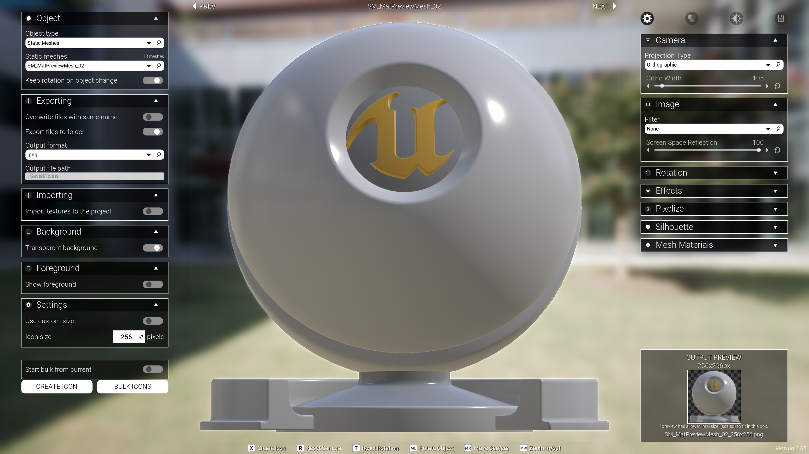

| `background texture`     | `transparent background`  | `color background`  | `foreground + no background`  | `foreground + background`  |
|:----------------:|:----------------:|:----------------:|:----------------:|:----------------:|
| 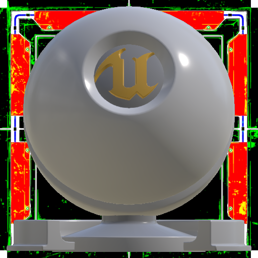 {width=200} | 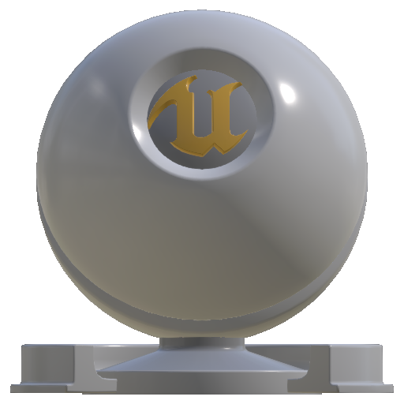 {width=200} | 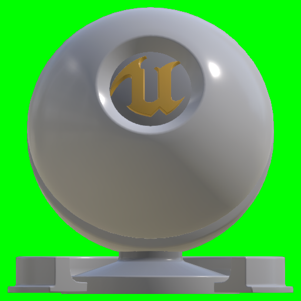 {width=200} | 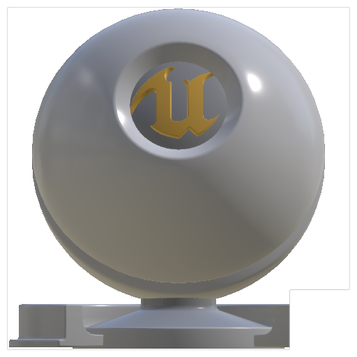 {width=200} | 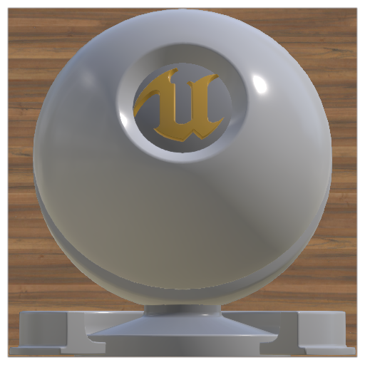 {width=200} |

You can export icons (.png, .jpg, .TGA and other output formats) or/and import them automatically into your project (.uasset).

## Getting started
### Unreal library
First of all, download and add it to your project. You can find it in your [Unreal Engine Library](https://www.unrealengine.com/marketplace/en-US/product/icon-generator).

<figure markdown>
{ width="250" }
<figcaption>Unreal Engine Library</figcaption>
</figure>

### Setup
After adding the asset to your project, open the `M_IconSetup` map. It can be found in: `Content → Icon Generator → Maps`.

<figure markdown>
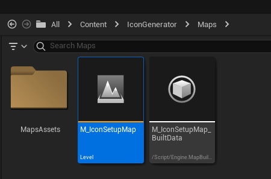
<figcaption>Icon Generator map</figcaption>
</figure>

Once in the map level, you’ll need to choose the load method. You have three options:

1.  Load assets using data tables;
2.  Load all assets in the project (via folder scanning);
3.  Load assets inside specific folders (via folder scanning).

To change between them, click in the blueprint in the level (the one with a red arrow, `IconGeneratorStartPoint`). Then, in the details panel, you'll see an exposed variable called `Load Method`. Changing this variable will affect the way that the objects are searched.

<figure markdown>
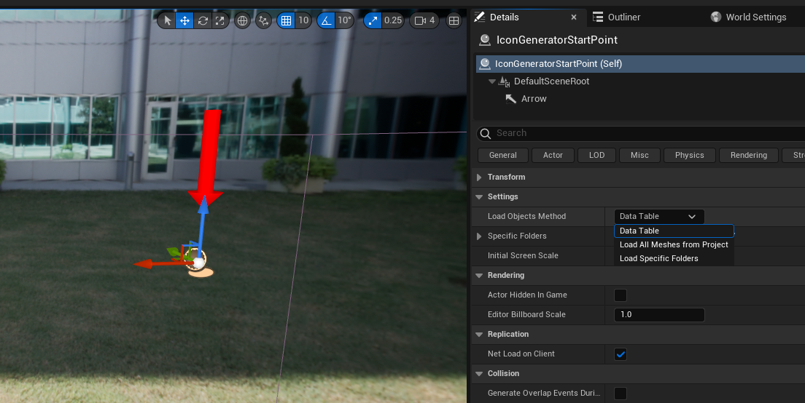
<figcaption>Load Method</figcaption>
</figure>

If you just want to see all of your meshes without further reading, select the load method `Load all` and hit play (this method still loads blueprints actors from a data table, the autosearch includes static meshes and skeletal meshes only). But if you want to know how each option works, let’s check it below (please, make sure to read the [{==#washed-colors==}](#washed-colors-correction) section).

#### Loading method: data tables
This load method is interesting for those who want to have control over the loaded list, with specific objects. To use it, set the `Load Method` variable to `Data Table`.

<figure markdown>
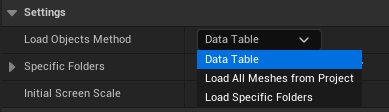
<figcaption>Load Method: Data Table</figcaption>
</figure>

Now, all the objects will be loaded from data tables, located in `Content → Icon Generator → DataTables`. They are: `DT_StaticMeshes`, `DT_SkeletalMeshes` and `DT_Blueprints`.

<figure markdown>
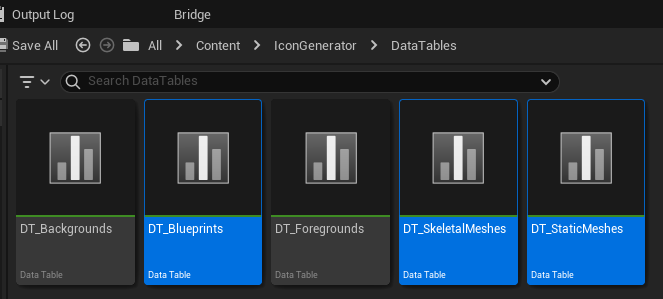{ width=500 }
<figcaption>Objects data tables</figcaption>
</figure>

??? tip "Tip: How to add itens to the data table"
	To add a new item to one of the data tables, open the one with the object type you want. Click on the `+` signal at the top. Then, select the row created and add the info. In the `DT_SkeletalMeshes` data table, you have an extra information: animations. You can add them manually for the skeleton you're adding or, alternatively, leave it empty (there is a toggle in the Icon Generator to autosearch animations in your project that are compatible with the current selected skeleton -- you can read more about it in the [{==#animations==}](#animations) section).

#### Loading method: load all
This is the easiest way to load your assets (Static Meshes and Skeletal Meshes). This method still loads blueprints from the `DT_Blueprints` data table (located in `Content → Icon Generator → DataTables`). It doesn't load all the assets in memory at once, as the name suggests. So there is no impact on performance: the objects are loaded only when called/needed (and unloaded if not), no matter how many objects you have on your project.

To use it, set the load method to `Load All Meshes from Project`.

<figure markdown>
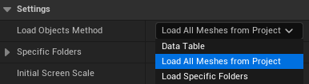
<figcaption>Load Method: Load All Meshes from Project</figcaption>
</figure>

As mentioned before, this method still loads blueprints actors from the `DT_Blueprints` data table.

<figure markdown>
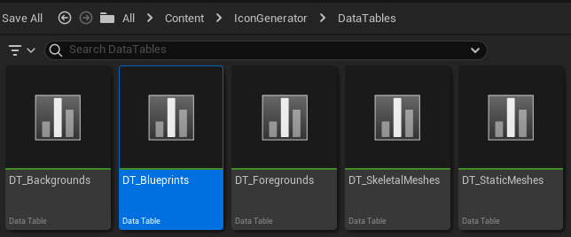{ width=500 }
<figcaption>Blueprints data table</figcaption>
</figure>

The skeletal meshes animations can be loaded using a toggle in the Icon Generator. It autosearches animations in your project that are compatible with the current selected skeleton (more about it in the [{==#animations==}](#animations) section).

#### Loading method: load folder
This load method is very similar to the previous one (it loads Static Meshes and Skeletal Meshes – blueprint actors are still loaded from the DT_Blueprints data table). The difference is that in this method, you can specify which folders your assets are in. It uses a recursive search, so if you have subfolders inside this folder, these folders will also be searched.

To use it, set the load method to `Load Specific Folders`.

<figure markdown>
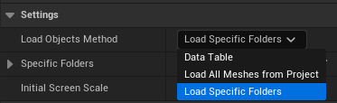
<figcaption>Load Method: Load Specific Folders</figcaption>
</figure>

Then, right below the load method, there is the array `Specific Folders`. Here you can add one or more folder paths to search your meshes. The default value is `/Content/`, meaning that it will search your entire `Content folder`, similar to the previous method but without the engine assets.

<figure markdown>
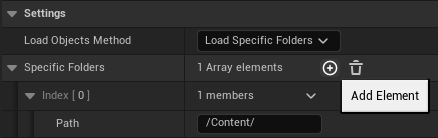
<figcaption>Specify folders</figcaption>
</figure>

!!! example "Example: adding a specific folder"
	As an example, let's say we want to load the assets that are in `Content → MyFolder → MyAssets`. Then, all we need to do is to change the path to `/Content/MyFolder/MyAssets`. That way, only assets in this folder (and subfolders) will be loaded. If you want to add more than one folder (if it is in a different path, for example), just hit the `+` button in the array and add as many paths you want!

	<figure markdown>
	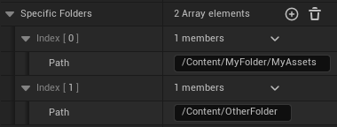
	<figcaption>Folder path example</figcaption>
	</figure>

### Washed colors correction
If you’re using the `import icon to the project` option (the one where automatically imports the texture to your project), the icon generated will look just fine when you open it, but it can show a washed color when inside widgets:

<figure markdown>
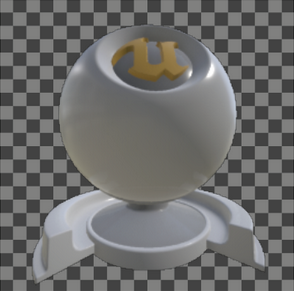{ width=200 align=left }
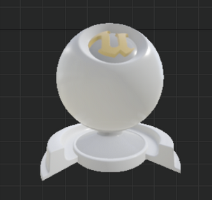{ width=209.7 align=right }
<figcaption>Image viewer vs widget viewer</figcaption>
</figure>

It is noticeable that the widget viewer shows an icon with a washed color. There is, however, a simple fix: you just need to check the `sRGB` checkbox in the texture viewer (marking it as true).

=== ":material-image: `Texture details panel`"
	<figure markdown>
	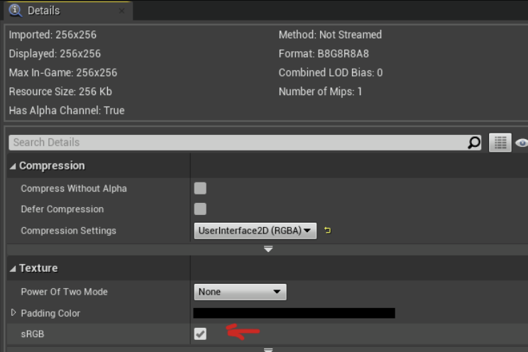
	<figcaption>sRGB option (located in the details panel after opening the texture)</figcaption>
	</figure>
=== ":material-image: `Texture panel zoomed out`"
	<figure markdown>
	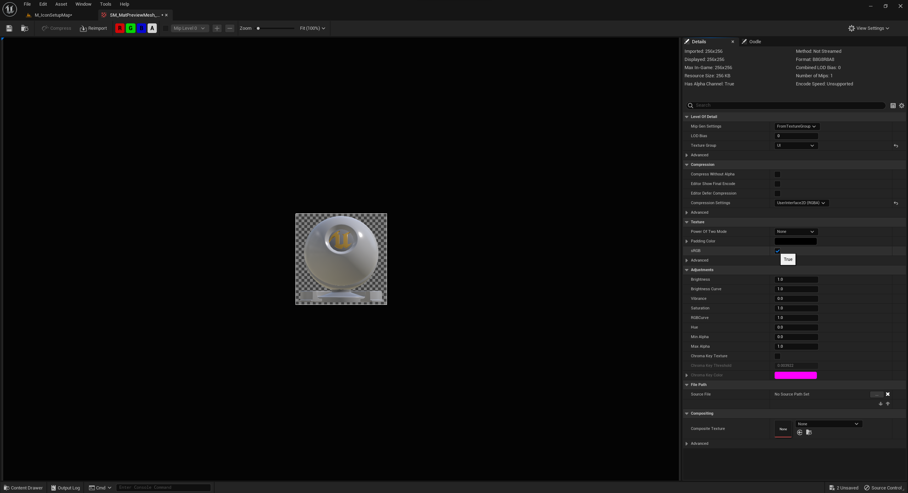
	<figcaption>Zoomed out texture viewer</figcaption>
	</figure>

After the sRGB fix, the texture appearance will look as it should in the widget viewer and you'll be able to save it.

<figure markdown>
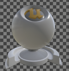{ width=200 align=left }
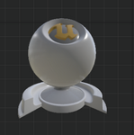{ width=204.27 align=right }
<figcaption>Image viewer (sRGB as true) vs widget viewer</figcaption>
</figure>

!!! tip "Tip: If you have more than one texture, you don’t need to apply sRGB one by one." 
	It is possible to do it with all textures at once. Select all textures you want to apply the sRGB, right click over one of them, go to `Asset Actions`, then `Bulk Edit via Property Matrix`.

	<figure markdown>
	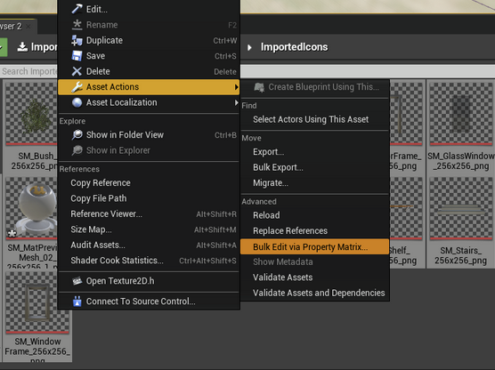
	<figcaption>Bulk Edit via Property Matrix</figcaption>
	</figure>

	Then, in the opened window, expand the `texture` section and mark `sRGB` as `true`. So, all the textures selected will be changed to sRGB at once!

	Below you can see this window in UE4 and UE5.

	=== ":material-unreal: `Unreal Engine 5`"
		<figure markdown>
		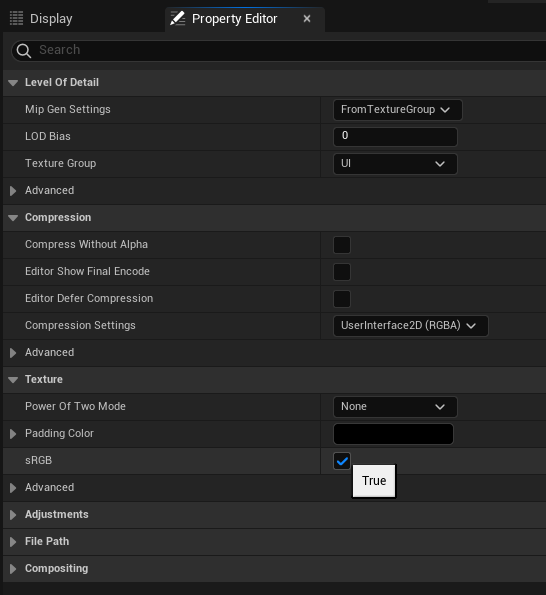
		<figcaption>UE5 texture details</figcaption>
		</figure>
	=== ":material-unreal: `Unreal Engine 4`"
		<figure markdown>
		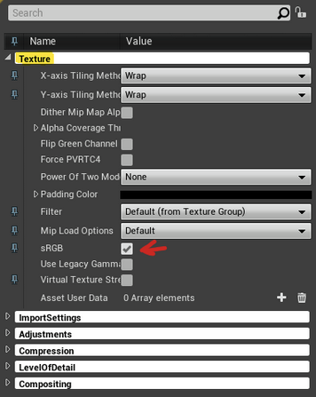
		<figcaption>UE4 texture details</figcaption>
		</figure>

### Animations
You can load animations for your skeletal meshes and create icons of its poses. There are two ways to do this.

The first and easiest is by enabling the toggle `Autosearch valid animations` in the `Animations` tab (this tab appears after selecting the object type `Skeletal Meshes`). This toggle is available from version 1.05 above (marked at the bottom right corner).

<figure markdown>
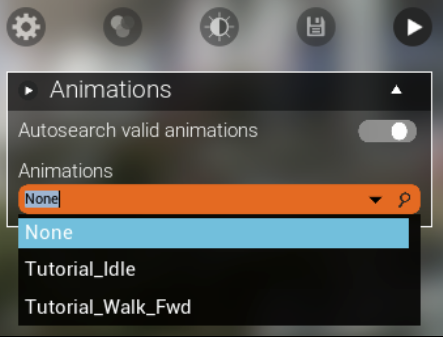{ width=300 }
<figcaption>Animations toggle</figcaption>
</figure>

All the animations of the selected skeletal mesh will appear in the `Animations combobox`. If the selected skeletal mesh doesn't have animations, only the `None` value will show up.

The second method is via data table. First you need to choose the load method `Data Table`. Then, you can choose animations in the `DT_SkeletalMeshes` data table. You’ll find these animations in the animations tab as showed in the image above (if the toggle is marked as false and the selected skeleton has animations in the data table).

<figure markdown>
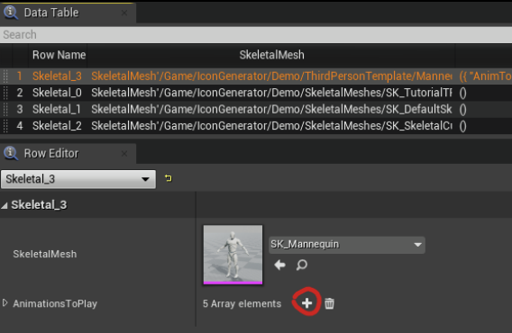{ width=500 }
<figcaption>DT_SkeletalMeshes data table and its animations</figcaption>
</figure>

Notice that the toggle is still there, so you can also mark it as true to load animations even in the `Data Table` load method.

!!! info "Both methods support animation sequences and anim montages."

### Export vs Import
Both located on the left panel of the Icon Generator, their names can cause confusion.

##### Export
The export function is used to create and export an external image file (.png, .jpg, .TGA etc). The file will not appear on the editor content folder. If you're using the default path (which is `Your Project → Saved → Icons`), you need to navigate to this folder to see the icon.

Alternatively, you can set a path of your choice in the `output file path` field.

<figure markdown>
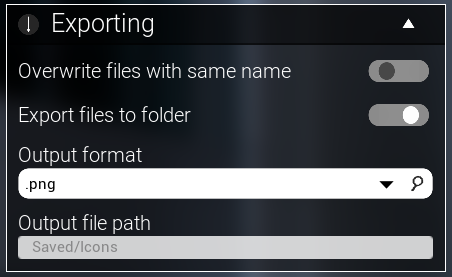{ width=350 }
<figcaption>Export function</figcaption>
</figure>

This functions allows you to create icons in any size. Power of two is **not** a requirement.

##### Import
The import function is used to create an `.uasset` texture file that will appear in your content folder, and you'll be able to see it inside the editor. You can imagine it as a shortcut of exporting an icon and then importing it manually to the project (as we normally do with textures). Make sure to apply the sRGB fix ([{==#washed-colors-correction==}](#washed-colors-correction) section), otherwise the icon create will not be saved.

<figure markdown>
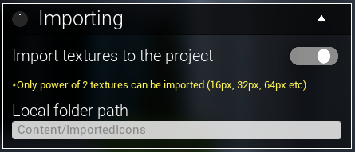{ width=350 }
<figcaption>Import function</figcaption>
</figure>

But the importing function has a limitation. Only `power of two` icons can be created (unfortunately I can’t change this, it is an internal function of the Unreal Engine).

!!! info ":octicons-number-24: Power of two sizes"

	These are valid icon sizes:  16x16, 32x16, 2048x1024, etc.

	And these are invalid icon sizes: 79x16, 34x34, 2000x1000, 32x25, etc.

	In summary, the numbers must be $2^n$. Examples:
	
	*	$2^4 = 16$
	*	$2^5 = 32$
	*	$2^6 = 64$
	*	$2^7 = 128$
	* 	$...$

	So these are valid power of two sizes, defined by $2s$ x $2t$, where $s$ and $t$ are positive integer numbers.

### Background and foreground
You can add your own custom background/foreground textures and/or remove the starter textures. To do this, open the `DT_Backgrounds` for backgrounds and `DT_Foregrounds` for foregrounds, both located in `Content → Icon Generator → Data Tables`.

<figure markdown>
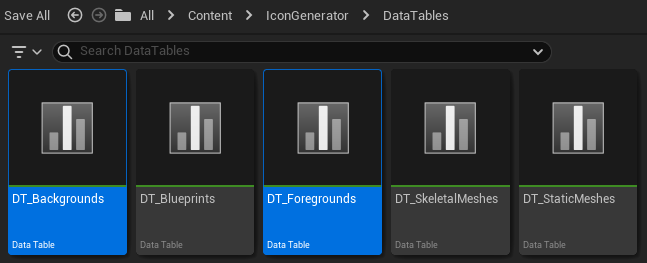{ width=500 }
<figcaption>Background and foreground data tables</figcaption>
</figure>

The content chosen in the `DT_Backgrounds` data table will appear inside the backgrounds box (if you mark the toggle `transparent background` as `false` and select the `background type` as `Texture`, otherwise it will be hidden).

<figure markdown>
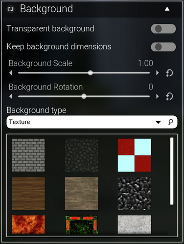{ width=250 }
<figcaption>Background textures</figcaption>
</figure>

The content chosen in the `DT_Foregrounds` data table will appear inside the foregrounds box (if you mark the toggle `show foreground` as `true`, otherwise it will be hidden).

<figure markdown>
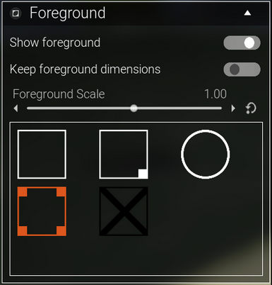{ width=250 }
<figcaption>Foreground textures</figcaption>
</figure>

### Bulk icons
Icon Generator has a button to bulk icons. This bulk creates icons for each object you have of the current object type selected. You have the option to start the bulk from the current object (toggle `Start bulk from current`).

You may notice that some assets can take a few seconds to be fully loaded (material and LOD), depending on your machine and the object complexity. Some cases, objects do not have enough time to render properly before the icon generation occurs (the time between the current object and the next, when the icon is created). The object is loaded only when called to appear in the screen (resulting in a optmized application, once you don't need to wait several minutes to start using it or to have a list of all objects).

If you need more time for each icon (to wait it load properly), it is possible to increase this "wait" time in the bulk export (of course, increasing it will result in more time to complete the bulk for all). To increase it, you can follow [this tutorial](https://youtu.be/vVP19zncg6U?list=PLHdESzTufIORQ6LbFutzgkbN-bDREGU8M) video or the steps below.

Open the `UI_ObjectRender` widget, located at `Content → IconGenerator → Widgets`.

<figure markdown>
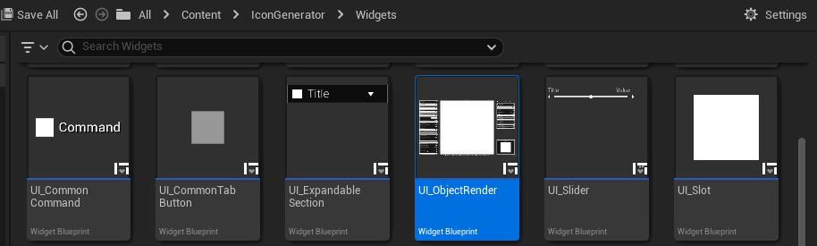
<figcaption>Bulk export delay per object - part I</figcaption>
</figure>

At the top right corner, click on `Graph` to open the widget blueprint. Then, in the variables panel, open the section `EDITABLE`. Here you'll see some variables to customize. For this section, the importants are `BulkDelayPerMesh` and `BulkDelayPerBlueprint`. Increase these variables values to have more time for each object be properly loaded based on your machine. The greater this value, the greater will be the total time to bulk all (this time x total objects to bulk).

<figure markdown>
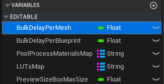
<figcaption>Bulk export delay per object - part II</figcaption>
</figure>

### Post process and filters
You can add or remove post process and filters from Icon Generator. To do this, follow the steps below or [this video](https://youtu.be/L-wfRZ8wK5k?list=PLHdESzTufIORQ6LbFutzgkbN-bDREGU8M) (for post process) and/or [this video](https://youtu.be/g9oqq1dLi6Q?list=PLHdESzTufIORQ6LbFutzgkbN-bDREGU8M) (for filters -- LUTs).

Open the `UI_ObjectRender` widget, located at `Content → IconGenerator → Widgets`. At the top right corner, click on `Graph` to open the widget blueprint. Then, in the variables panel, open the section `EDITABLE`. Here you'll see some variables to customize. For this section, the importants are `PostProcessMaterialsMap` and `LUTsMap`. Click in one of them to start the customization. You'll see a map variable, where the left side is the name that will appear at right side panel of the Icon Generator (each name must be unique). And the right side of the map is a LUT or a Post Process, depending on the selected variable. You can add your own post process materials or LUTs here (or delete them).

<figure markdown>
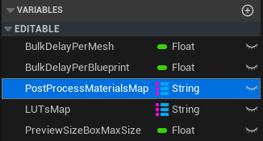
<figcaption>Post process materials and LUTs</figcaption>
</figure>

### Controls
Icon Generator has some input controls:

| 	`Key`     			| `Action/Description`
|	----------------:	| :----------------
|	Left mouse button 	| Click and hold over the object. Move the mouse to rotate.
|	Right mouse button	| Click and hold over the object. Move the mouse to move the camera position.
|	W, A, S and D 		| Press one of them to move the camera position.
|	Mouse scroll 		| Zoom in/out (camera movement in the object direction).
|	X 					| Creates the icon of the current object (shortcut).
|	R 					| Resets the camera position (shortcut).
|	T 					| Resets the object rotation (shortcut).

### Update log
* Update 1.05

	???+ info "Update 1.05 changes"
		*	Added foreground option;
		*	Autosearch for animations (it searches animations for each skeleton without impact on performance or memory usage);
		*	Ambient occlusion support;
		*	Controls for the main light;
		*	Version is now showed at the bottom right corner.

* Update 1.04

	??? info "Update 1.04 changes"
		Added “move camera” using the mouse right button. Keys WASD keep working for the same function.

* Update 1.03

	??? info "Update 1.03 changes"
		* Orthographic camera option; 
		* Improved pixel effect;
		* Silhouette option;
		* Improved item placement on screen; 
		* New background approach (using material instead of a world object);
		* Performance optimization;
		* Option to apply (or not) pixel effect on background;
		* Background no more reflecting on the object;
		* General adjustments on UI.

* Update 1.02

	??? info "Update 1.02 changes"
		Added a box to change the mesh materials (works with static meshes and skeletal meshes). You can check a preview [here](https://youtu.be/-2eUb7gFzxA).

* Update 1.01

	??? info "Update 1.01 changes"
		Added a searchable box. You can see how it works [here](https://youtu.be/DEGmrB_e8pk).

### Questions and Answers

??? question "What kind of objects can I use to create icons with this tool?"
	You can create icons for static meshes, skeletal meshes and blueprints actors.

??? question "Does this asset support Post Process?"
	Yes, it does, for both transparent or non-transparent backgrounds. Some post process variables are exposed using sliders (like saturation, contrast, gamma, post process materials, LUTs etc), but you can also edit the post process manually as you want editing the post process volume in the level.

??? question "I’m using UE5.1 and the objects looks transparent in the viewport  and the icon comes out totally black. How do I fix this?"
	Unreal Engine 5.1 included the alpha composite in the “cinematic” setting to be properly rendered (which is a regression compared to previous versions of the engine, the issues was reported to the epic team). And we need to use alpha composite.
	
	That means you need to set the scalability option `Effects` to `Cinematic`. [Here is a video showing how you can do it](https://youtu.be/JbM5bPsHho4). If you downloded Icon Generator from your Unreal Engine library after 2023-06-01, the asset code changes this scalability setting automatically (and brings the original value back to default after closing the level).

??? question "Every time I close the Icon Generator on Unreal Engine 5.1, it loads some shaders again. Why does this happen? There is a way to avoid this?"
	This happens because of the previous question: UE5.1 introduced an issue where the alpha composite appears only if the `Effects` quality is set to `Cinematic` (and, in some computers, `Epic` quality is enough).
	
	So the project in UE5.1 changes it to “Cinematic” automatically when you hit play, and turns it back to its default when closing. To avoid the shaders recompiling, [you can try this](https://youtu.be/JbM5bPsHho4) (setting to `cinematic`) and the loading will happen only once, as it will be changed from `cinematic` to `cinematic` (so no changes to be compiled).

??? question "I’m using the `Import textures to the project` function/toggle. When I use the texture generated on a widget, it looks washed. How can I fix this?"
	When the Unreal Editor generates the texture (in this case, specifically the importing function and not the export one), for some reason the “sRGB” checkbox is marked as false by default, so the color looks washed because of that (even if I set it to sRGB true in the code, the color will show up washed, that’s why the following process needs to be done manually).
	
	So, to fix it, you need to mark the `sRGB checkbox` as `true` in the texture details panel. If you have more than one texture, it is possible to do it all at once – the documentation video shows how to do that (or you can check the [{==#washed-colors-correction==}](#washed-colors-correction) section), starting at 5min 22s ([this link](https://www.youtube.com/watch?v=gOroSCY0eSc&list=PLHdESzTufIORQ6LbFutzgkbN-bDREGU8M&t=321s&ab_channel=A.)).

	<figure markdown>
	
	<figcaption>sRGB</figcaption>
	</figure>

??? question "This asset can create textures with custom size?"
	Yes! You just need to mark the `custom size` toggle as `true` and an extra box will show up to insert the custom size.

	<figure markdown>
	{ width=250 align=left }
	{ width=244.05 align=right }
	<figcaption>Custom size toggle</figcaption>
	</figure>

??? question "I’m trying to import my texture using the Import toggle option, but the texture is not being generated (it says “done” but I can’t find it)."
	Only `power of two` can be imported using the `Import toggle` (unfortunately I can’t change this, it is an internal function of the Unreal Engine).

	These are valid icon sizes:  16x16, 32x16, 2048x1024, etc.

	And these are invalid icon sizes: 79x16, 34x34, 2000x1000, 32x25, etc.

	In summary, the numbers must be $2^n$. Examples:
	
	*	$2^4 = 16$
	*	$2^5 = 32$
	*	$2^6 = 64$
	*	$2^7 = 128$
	* 	$...$

	So these are valid power of two sizes, defined by $2s$ x $2t$, where $s$ and $t$ are positive integer numbers.

??? question "How can I increase the bulk delay per object? The current time is not enough to load the textures on my machine."
	You can increase the float variable `bulk delay per mesh` of the `UI_ObjectRender` widget. Take a look at the [{==#bulk-icons==}](#bulk-icons) section for more details about increasing the bulk delay.

??? question "I get an error when spawning my blueprint and closing the icon generator level."
	You’ll get red errors only if your blueprint depends on any reference that is not in the level. For example, if your blueprint needs the reference of a specific actor (let’s say a health potion blueprint needs the player_character_3 reference), as the actor is not in the level, the reference will be null, so if the blueprint needs that reference in any point, it will show you an error. In any case, you don’t need to edit your blueprints, the error will not cause you any problems to generate the icons (of course, as long as its visual is not dependent on other actors).