---
hide:
    - navigation

title: Lock-on Targeting System
---
*[LTS]: Lock-on Targeting System

# Lock-on Targeting System V4

## Introduction
This project was influenced by the Souls series, especially Bloodborne.

=== ":material-image: Bloodborne"
    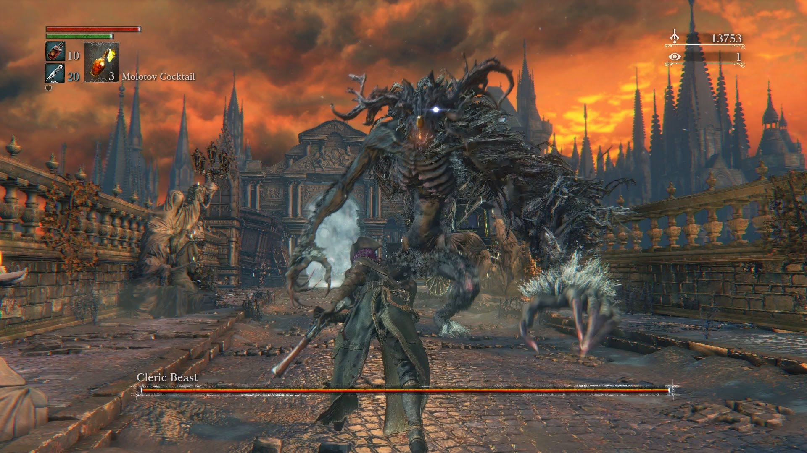

=== ":material-image: Demon's Souls"
    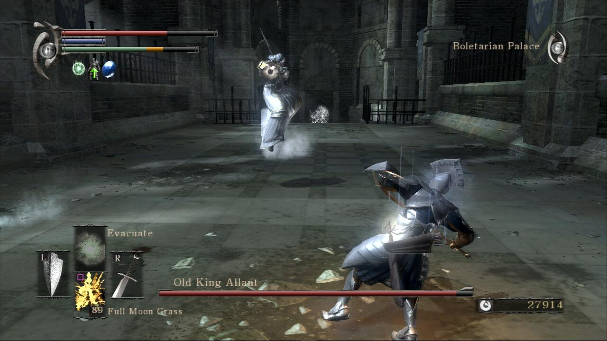

=== ":material-image: Dark Souls"
    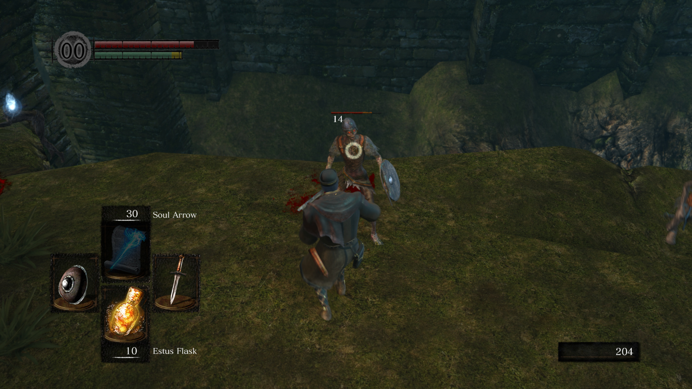

=== ":material-image: Elden Ring"
    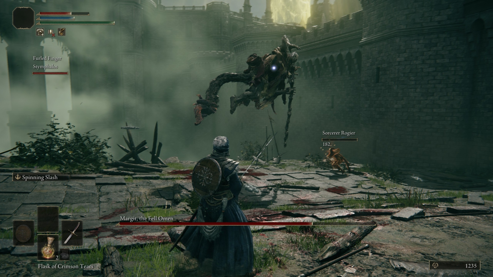

=== ":material-image: Sekiro"
    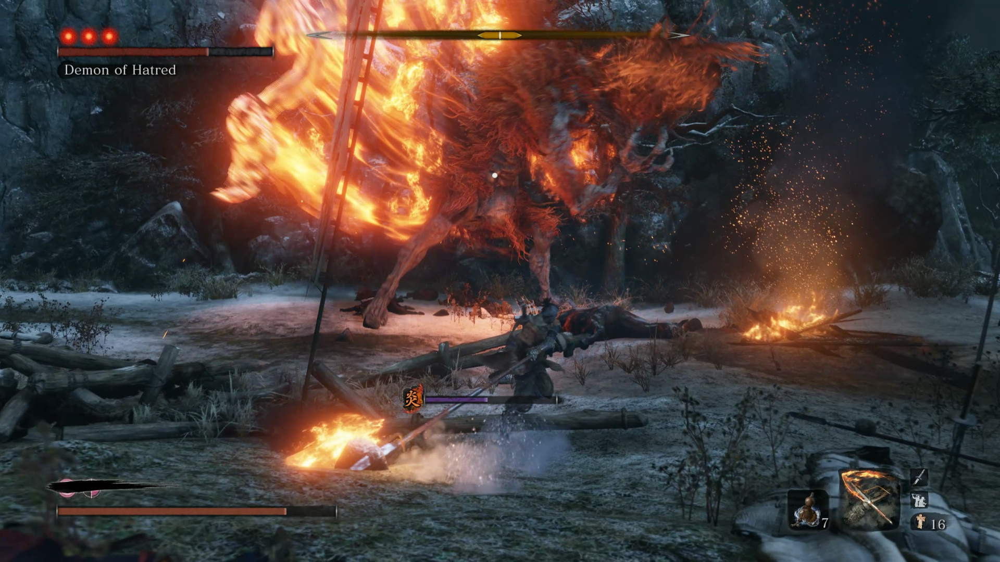

Built to be precise and highly customizable, this system has math at its core. With a quick and easy installation, you can use it in the most varied projects. Made using blueprints only.

## Supported versions
Version 4.0 was launched for Unreal Engine 4.26 to 5.1. So you still have access to previous versions (all of them are compatible with 4.26-5.1), being version 3.0 available in 4.24-4.25 and version 2.0 available in 4.17-4.23. You can check the documentation for previous versions in the [{==#previous-versions==}](#previous-versions) section.

This new version brings a lot of new content, including a new input system (now you can switch targets in any direction), multitargeting system, simple softlock, native support for splitscreen projects and much more. Check it in the [{==#update log==}](#update-log) section.

### Supported projects
* Third and first person games
* Top/down games
* Fixed camera games
* Splitscreen games
* Network games

## Getting started

### Unreal library
First of all, download and add it to your project. You can find it in your [Unreal Engine Library](https://www.unrealengine.com/marketplace/en-US/product/lock-on-targeting-system).

<figure markdown>
  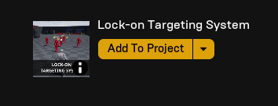{ width="300" }
  <figcaption>Unreal Engine Library</figcaption>
</figure>

### Setup
You can check out [this video](https://youtu.be/pr8rlD5Ygtc) to watch the LTS setup, or follow the steps below.
The LTS V4 uses two main components: the lock-on component and the target component. They were separated into _two_ for optimization and practicality purposes, so that only the necessary variables are used in the target. The main steps you'll check below are, in summary:

| `Lock-on component`             | `Target component`        | `Extra stuff: tips and customization` |
|-------------------------------|-------------------------|-------------------------------------|
| Adding lock-on component      | Adding target component | Debug component                     |
| Setting up the input settings | Setting up the sockets  | Reticle override component          |

### Adding the lock-on component
This component goes to the pawn you want to perform the lock-on action (so controlled by a player).

Open your character blueprint and go to the components panel (normally at the top left corner). Click `Add Component` and search for "Lock". Add the `BPC Lock On` component.

<figure markdown>
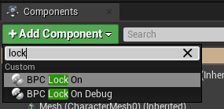{ width="300" }
<figcaption>Lock-on component (BPC_LockOn)</figcaption>
</figure>

!!! info

    We'll take a look on the `BPC Lock On Debug` later.

This component is the LTS core. It contains several useful functions that you can check in details in the [{==#functions==}](#functions) section.

#### Lock-on setup
Now let's setup the action keys. Drag and drop the lock-on component from your components panel into your event graph.

<figure markdown>
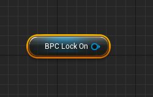{width=200}
<figcaption>Lock-on reference</figcaption>
</figure>

We'll call it `lock-on reference` from now on. Using this reference, call the function `LockOn Toggle`. Connect it to an event key you want or to an action key. This function is used to lock-on and unlock the target. You should have something like one of the two possibilities below:

<figure markdown>
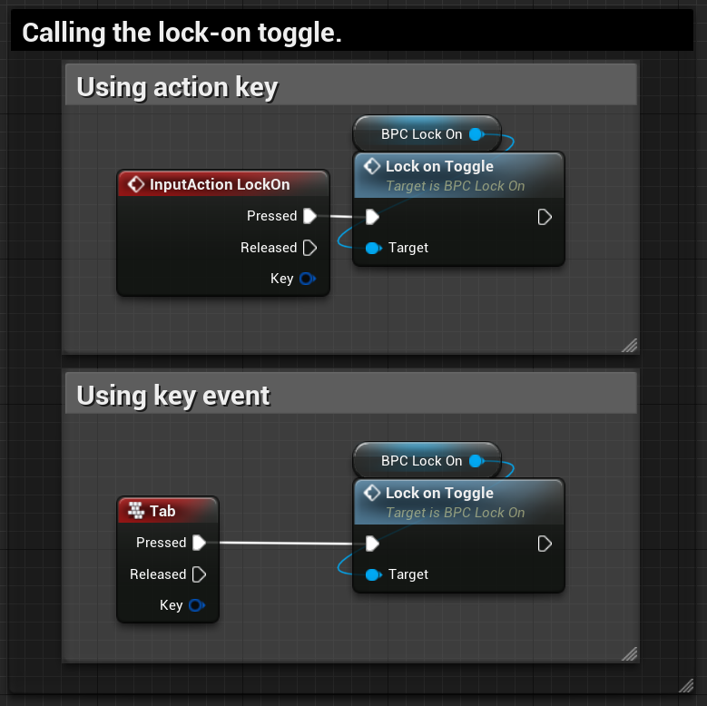{width=450}
<figcaption>LockOn Toggle function</figcaption>
</figure>

##### Switch targets setup
To setup the targeting switch, go to your camera movement nodes, [if you have one](#lock-on-setup "If not, check the tip below."). Connect the boolean returned by the function `isLockedOn` of the `lock-on reference` to a `branch` node. In the `false` output, connect your current logic flow. In the `true` output, connect the corresponding `Swap Target` function of the `lock-on reference`: `Yaw` for left/right movement and `Pitch` for up/down movement. You should have something like this:

=== ":material-mouse: Mouse Input"
    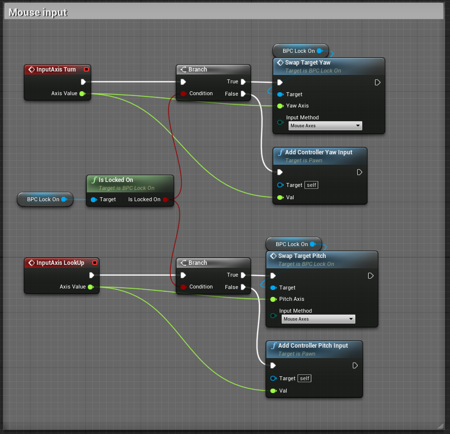

=== ":fontawesome-solid-gamepad: Gamepad Input"
    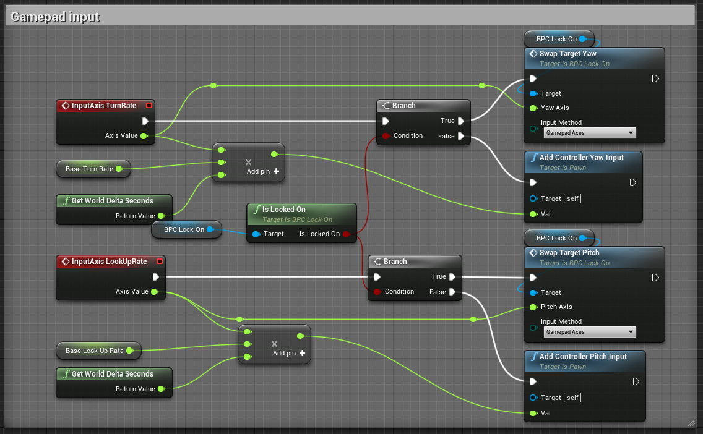

Below you can use `copy to clipboard` note and paste the functions mentioned right into your blueprint.

??? abstract "Copy-paste"

    === ":octicons-file-code-16: `Swap Target Yaw`"
        --8<-- "docs/codes/lock-on/swap-target-yaw.txt"

    === ":octicons-file-code-16: `Swap Target Pitch`"
        --8<-- "docs/codes/lock-on/swap-target-pitch.txt"

    === ":octicons-file-code-16: `isLockedOn`"
        --8<-- "docs/codes/lock-on/locked-on.txt"

??? tip "Tip: how to free the movement axes"
    If you want to free the movement of one or both axis, you can use the functions `Filter Yaw Axis` and `Filter Pitch Axis` and mark the option(s) `Free Yaw Axis` or/and `Filter Pitch Axis` in the `BPC_LockOn` details panel to do it. [Here is a demonstrative video](https://youtu.be/fi-yxiadYgI). Below you can check the setup in the tabs.

    === ":material-axis: Free Axis options"
        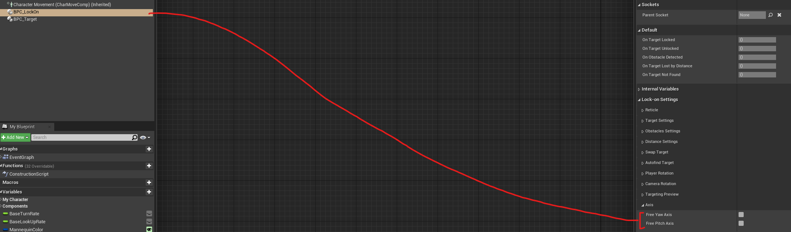

    === ":material-mouse: Mouse Input"
        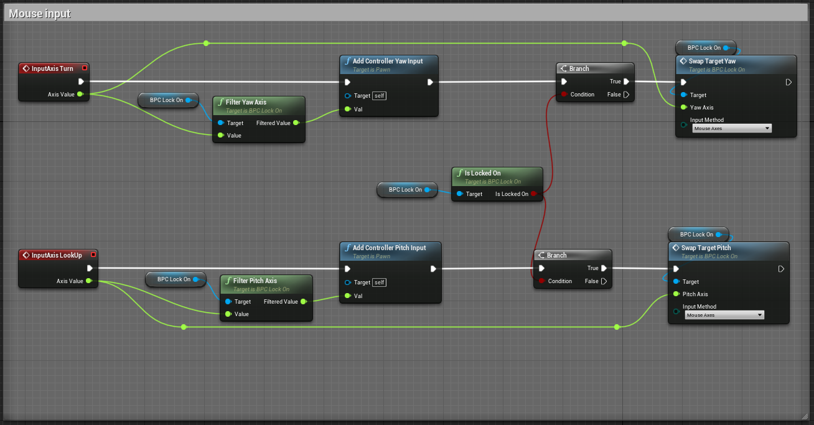

    === ":fontawesome-solid-gamepad: Gamepad Input"
        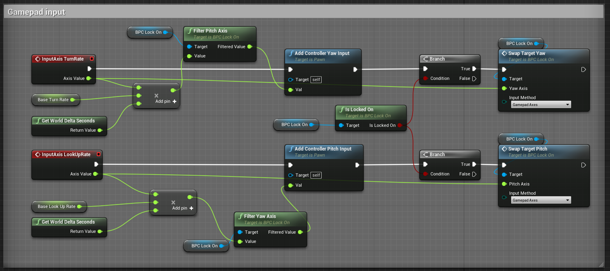

    ??? abstract "Copy-paste"
        === ":octicons-file-code-16: `Filter function`"
            --8<-- "docs/codes/lock-on/swap-target-example.txt"

??? tip "Tip: I do not have control over my camera in my game"
    If you do not have controls for your camera, you can use the same logic above, but using it on your functions to rotate the character or in the axis mappings for the mouse x and y (or gamepad stick). For example calling `Mouse X` and `Mouse Y` events (or the corresponding gamepad):

    <figure markdown>
    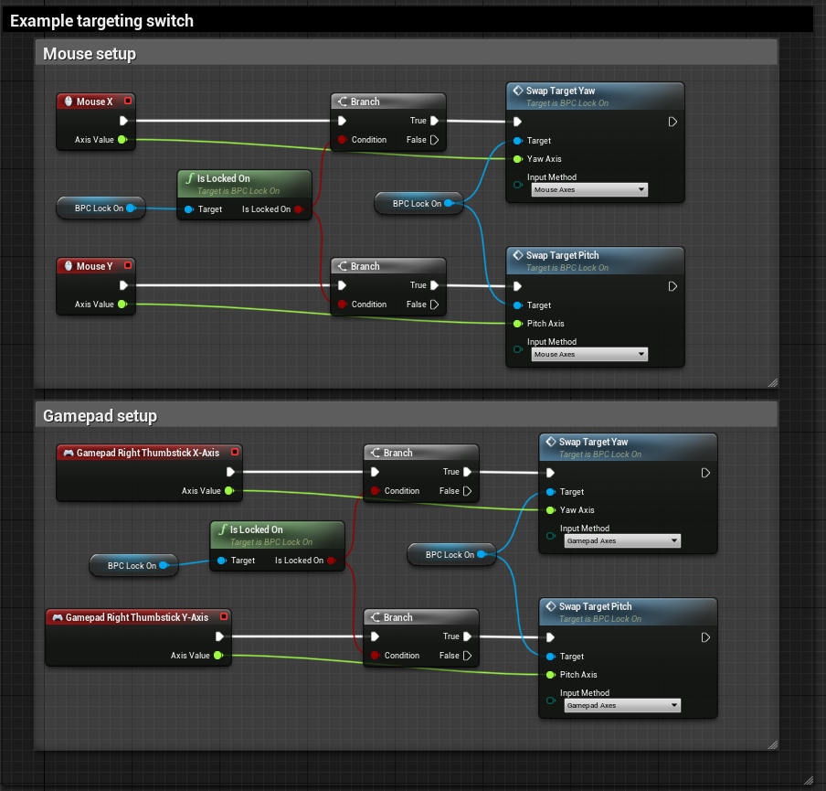
    <figcaption>Setup example, without control over the camera</figcaption>
    </figure>

    Feel free to copy and paste the nodes above using the code below.

    ??? abstract "Copy-paste"
        === ":octicons-file-code-16: `Swap Target: mouse and gamepad example`"
            --8<-- "docs/codes/lock-on/swap-target-example.txt"

    Also, I recommend that you change the variable `Search Target Direction` value to `Use Character Direction` (more details in [{==#customization==}](#customization))

If you do not want to use the mouse or/and gamepad to switch targets, but still can be able to switch them, you can use the function `Swap Target Manually` using the `lock-on reference`. This function requires as parameter a coordinate as following:

<figure markdown>
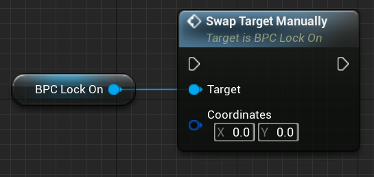{ align='left' width=500 }
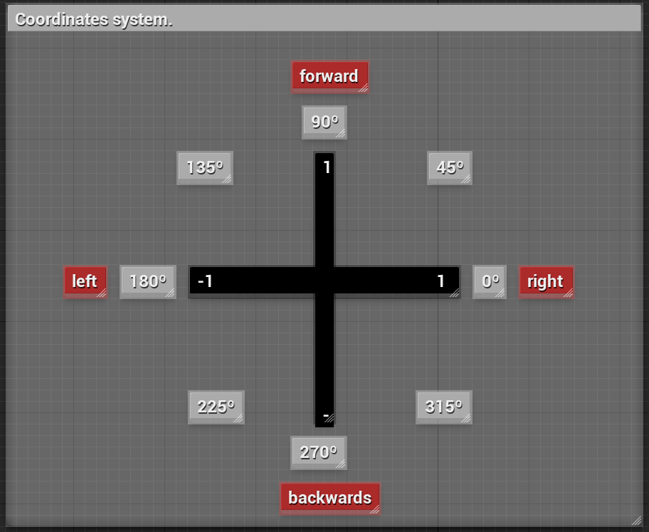{ align='right' width=290 }
<figcaption>Swap Target Manually and coordinate system</figcaption>
</figure>

??? abstract "Copy-paste"
    === ":octicons-file-code-16: `Swap Target Manually`"
        --8<-- "docs/codes/lock-on/swap-manually.txt"

The `X` and `Y` axes have the range `[-1, 1]`. For the `X` axis, -1 means left and +1 means right. For the `Y` axis, -1 means backwards and +1 means forwards. You can combine them to create a direction.

##### Quick notes
You can customize the lock-on component by clicking on the BPC_LockOn component and going to the details panel. There are several customization options, which will be discussed in the [{==#variables==}](#variables) section.

!!! warning "Collision detection"
    Before going further, please make sure to check the object collision types detection, on the `lock-on component` details panel. Here you choose what kind of `objects` will be considered as possible target.

    <figure markdown>
    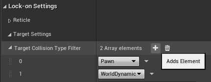
    <figcaption>Detected collision type</figcaption>
    </figure>

!!! Note "Variables and functions tooltips"
    All variables have a tooltip explaining what they do. To see it, just hover over the variable. The same is valid for any function: hover over the function or open it to see what it does.

### Adding target component
This component goes to any actor you want to be able to lock-on. The only requirement is that this target must have at least one component with collision, otherwise the target will not be detected by the lock-on system.

!!! warning "Component object collision type"
    Make sure that at least one component of the actor has as `Object Type` some type of collision present in the lock-on component. Otherwise this target will not be detected!

    <figure markdown>
    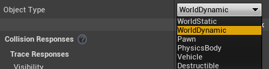
    <figcaption>Object type in at least one component collision</figcaption>
    </figure>

    In this example, the object type is `WorldDynamic`, which is included in the array `Target Collision Type Filter` of the `lock-on component`. If it was `WorldStatic`, for example, you have two options: or to change the `object type` to something present in the `Target Collision Type Filter`, or to include `WorldStatic` in the `Target Collision Type Filter` array. You can find the collision going to details panel after clicking in one component inside the actor blueprint.

To add the `Target Component`, open the actor you want to be able to lock-on, go to the components panel. Click `Add Component` and search for "Target". Add the `BPC Target` component.

<figure markdown>
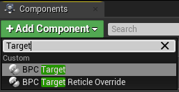
<figcaption>Target component</figcaption>
</figure>

!!! info

    We'll take a look on the `BPC Reticle Override` later.

##### Choosing sockets to lock-on
After adding the `Target Component`, you need to choose the component(s) and socket(s) you want to lock-on on this actor. To do that, click on the `Target Component` and check the `details` panel. Search the variable `Mesh and Sockets` and add the component name you want to lock-on.

!!! danger "Be careful"
    If this component is `inherited`, you need to use the component name which is enclosed in parentheses. For example, if I have a pawn and I want to add to lock-on the pawn `skeletal mesh`, I'll use its name enclosed in parentheses, because it is `inherited`, as showed below:
    <figure markdown>
    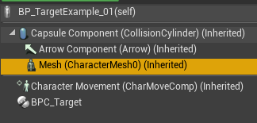
    <figcaption>Inherited components are indicated as `(inherited)`</figcaption>
    </figure>
    In this example, I'll use `CharacterMesh0` as the component name. After that, you can add a socket present in this component. In my example, `spine_02`. If your component doesn't have sockets, you can leave it as "None" and edit the offset. Vector at the right side of the socket name is the offset in relation to the chosen socket.
    <figure markdown>
    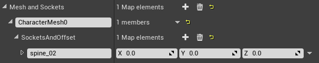
    <figcaption>Chosen component, socket and offset</figcaption>
    </figure>
    If the component is not inherited, as the example below, you can use its normal name:
    <figure markdown>
    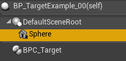{ align=left }
    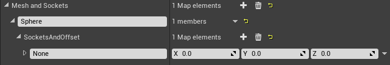{ align=right width=600 }
    <figcaption>Chosen component not inherited, socket and offset</figcaption>
    </figure>

    ??? tip "Tip: how do I find sockets in a skeletal mesh?"
        You can find sockets by opening the skeleton of the skeletal mesh. You can copy the bone name of the skeleton you want to lock-on and use it as the socket name.

Notice that you can add more than one component, and for each component you can add multiple sockets. Thais means you can have targets with multiple lock-on points.

??? tip "Tip: how to inform the system that a target is not a target anymore?"
    If you destroy the target (for example, an enemy's death, where its death event has a "destroy actor" at the end), nothing needs to be done. The component will be destroyed with the actor.

    For any other case (like death event, but not destroying the target or a target that becomes a friend), you just need to call the function `SetIsTarget` on the target blueprint, using the `Target Component` reference, where the `bIsTarget` parameter is `false`. If you want to turn it a target again, call the same function but with `bIsTarget` as `true`.

    <figure markdown>
    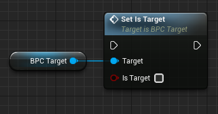
    <figcaption>SetIsTarget function</figcaption>
    </figure>

That's all for the `Target Component`. You can check some extra details in the [{==#variables==}](#variables) section, such as `bShowReticle` and `bIsTarget` variables.

!!! success "Setup finished"
    With these two components properly configured, you can use the Lock-on Targeting System V4.
    
    In the next sections, you'll see some details about the components and customization, but they're optional, not required to use the tool.

### Customization
LTS is a highly customizable tool. Each component has several exposed variables that you can edit in the details panel after clicking over the component on your character (`BPC_LockOn`) and target (`BPC_Target`). You can check each variable description in the [{==#variables==}](#variables) section. The next two subsections you'll see some cool variables to tweak.

#### Lock-on component

* `Search Target Method`: The search method defines the way that the targets will be searched. `Centered` means that the closest targets to the center of the screen are best targets; meanwhile `Nearest` will prioritize the closest targets. 

    ??? image "Search Target Method"
        === ":material-target: `Search Centered`"
            <figure markdown>
            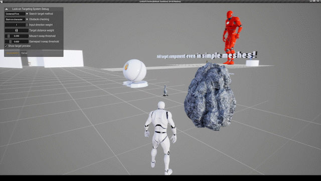
            <figcaption>Centered option</figcaption>
            </figure>
        === ":material-map-marker-distance: `Search Closest`"
            <figure markdown>
            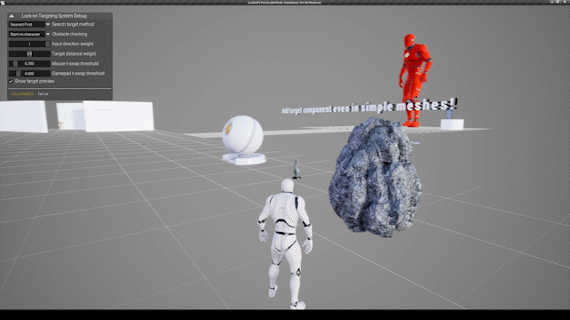
            <figcaption>Closest option</figcaption>
            </figure>

* `Search Target Direction`: this variable defines where the targeting search starts and ends, meaning it can start at the camera-to-forward, or start at the character-to-forward. `Use Camera Direction` is recommended for third/first person games; `Use Character Direction` is recommended for top/down and fixed camera games.

    ??? image "Search Target Direction"
        If you mark the variable `bConsiderOffscreenTargets` as `true`, the search sphere below will be centered at the characters' position or camera's position.
        === ":octicons-device-camera-video-16: `Use Camera Direction`"
            <figure markdown>
            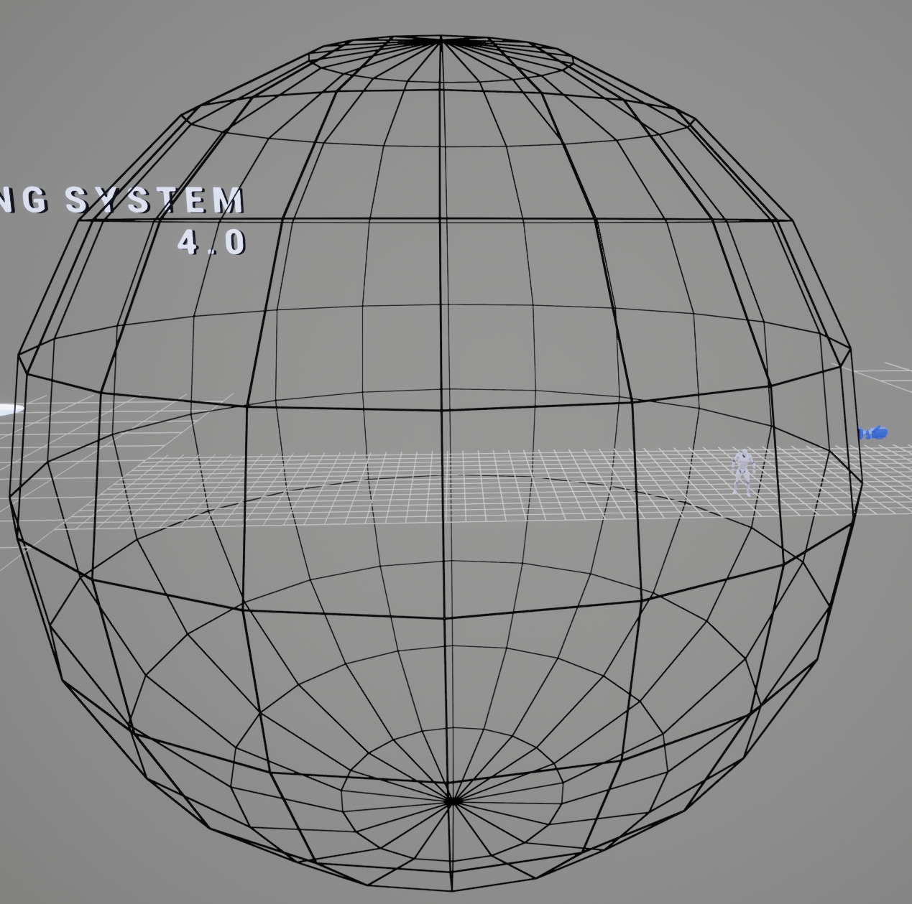{ width=500}
            <figcaption>The `search sphere` starts at `camera` and use its forward direction</figcaption>
            </figure>
        === ":material-human-male: `Use Character Direction`"
            <figure markdown>
            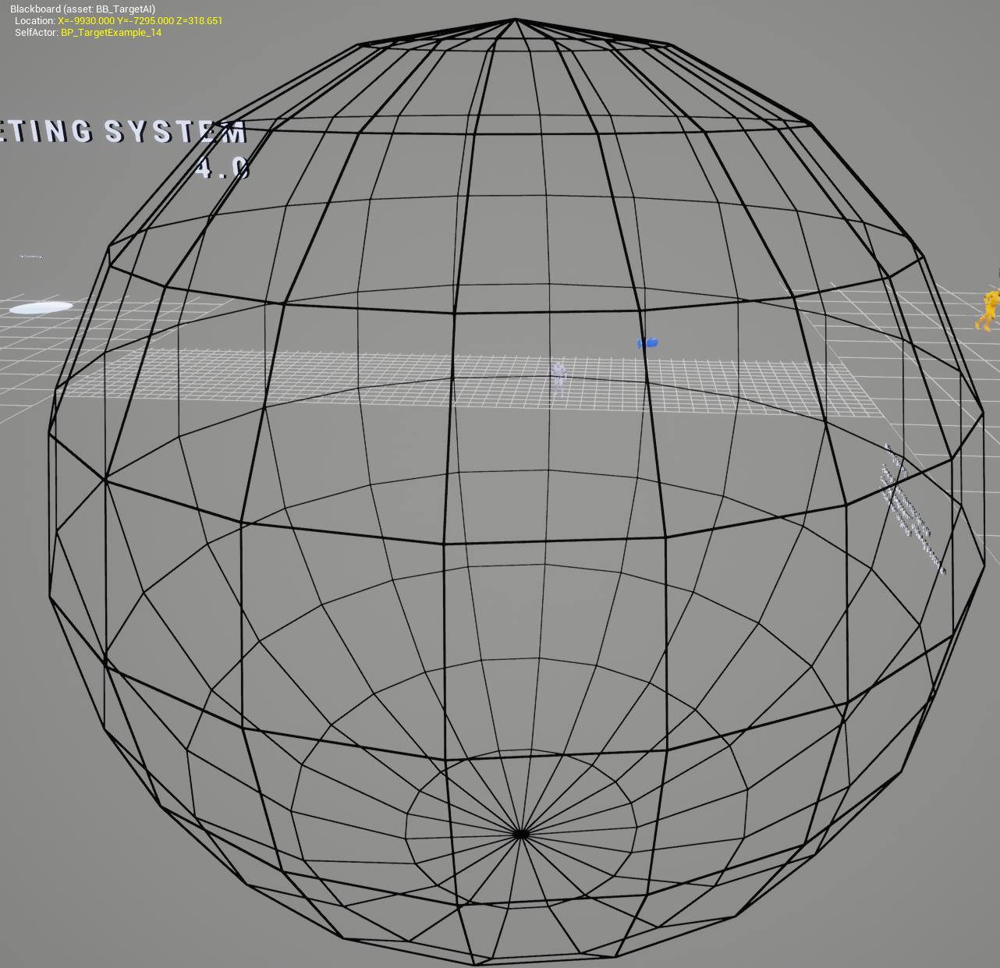{ width=500}
            <figcaption>The `search sphere` starts at `char` and use its forward direction</figcaption>
            </figure>

* `bRotatePlayerAtTarget`: If true, rotates the player to face the target. You have three rotation options in the `PlayerRotationType` variable: `UseControllerDesiredRotation` (recommended for third/first person games), `RotateOnTargetDirection` (recommended for top/down and fixed camera games) and `RotateOnCameraDirection` (similar to the first option, but it has corrections regarding the camera offset, which means it will corretly face the target no matter the camera/spring arm offset).

* `bRotateCamera`: If true, uses the control rotation to rotate the camera (make sure the boolean `Use Pawn Control Rotation` is true on the `spring arm component`, if you have one). You can set an offset using the variable `Camera Rotation Offset`, where `X` will add an offset in the horizontal direction, and `Y` will add an offset in the vertical direction. The variable `Camera Pitch Rotation Clamp` will clamp the pitch rotation (make sure it is in a range `[-90, 90]`).

* `bShowLockOnPreview`: If true, shows a preview reticle on the best target. It is updated each `PreviewUpdateTimer` (variable) seconds (by default, it updates each 0.1s). This reticle was influenced by Nier: Automata. Its reticle is defined by the variable `Lock on Preview Widget`.

    ??? image "Target Preview"
        <figure markdown>
        { width=800}
        <figcaption>Lock-on Preview</figcaption>
        </figure>

#### Target component
* `bIsTarget`: If true, the owner of this component will be considered as a target. Otherwise it will be ignored. You can use the function `SetIsTarget` in the actor to set the boolean variable in runtime (with replication).

* `bShowReticle`: If true, the targeting reticle will appear when locked-on. Otherwise it will be hidden.

## Extra components
LTS V4 has two extra components. They were made in extra components so as not to consume unnecessary memory in the main components: the debug and reticle override components.

### Debug component
A simple component made to check the lock-on status and to change some settings in runtime. To use it, just add the `BPC Lock on Debug` component to your character (the one that has the `LockOn` component).

??? image "Lock-on debug component"
    === ":material-code-tags-check: `Debug component`"
        <figure markdown>
        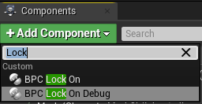{ width=326.3 align=left}
        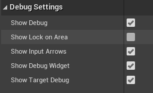{ width=275 align=left }
        <figcaption>Lock-on debug component</figcaption>
        </figure>
    === ":material-widgets: `Debug Widget`"
        <figure markdown>
        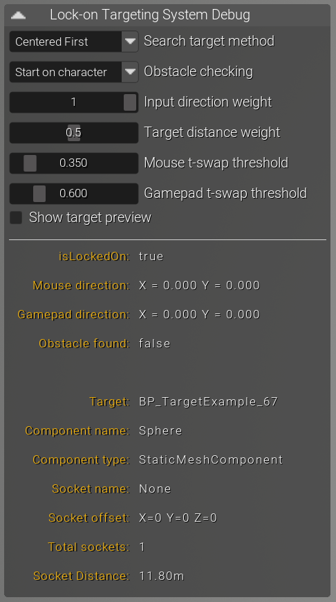
        <figcaption>Lock-on debug widget</figcaption>
        </figure>
    === ":material-axis-arrow: `World debug`"
        <figure markdown>
        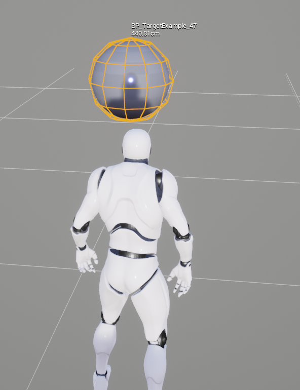
        <figcaption>Lock-on debug in world</figcaption>
        </figure>

### Reticle override component
This component is used in the target actor. It overrides the targeting reticle when locking-on the actor that owns this component. So you can, for example, create a custom reticle for a boss: when the player lockes it, the custom reticle will be shown.

??? image "Override reticle example"
    In the example below, the orange target has the `BPC_ReticleOverride` component.
    <figure markdown>
    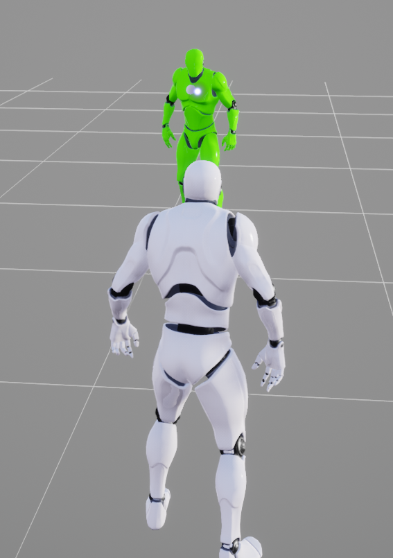{ width=398.5 align=left}
    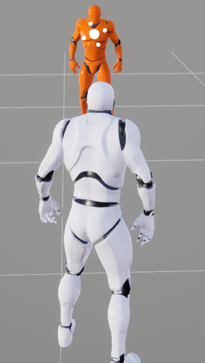{ width=320 align=left }
    <figcaption>Normal reticle vs overwritten reticle</figcaption>
    </figure>

## Functions and dispatchers
You can find the functions descriptions below. They have a tooltip description and comments inside it (to check in the project, just hover over the function or open it!).

??? abstract "Functions descriptions"
    === ":material-table: `BPC_LockOn component`"
        --8<-- "docs/codes/lock-on/lock-on-functions.txt"
    === ":material-table: `BPC_Target component`"
        --8<-- "docs/codes/lock-on/target-functions.txt"
    === ":material-table: `BPC_LockOnDebug component`"
        This component doesn't have functions.
    === ":material-table: `BPC_TargetReticleOverride component`"
        --8<-- "docs/codes/lock-on/reticle-functions.txt"

??? tip "Tip: How can I bind the lock-on status to my animations?"
    You can use the function `isLockedOnREPLICATED` on your blueprint animation. This function returns a boolean to inform if the player has some target locked-on. So, for example, you can use this information to change the current movement animation on your AnimGraph/State Machine. Below you can see how to get the lock-on status information (the example shows a cast to `ThirdPersonCharacter`, which should be changed to your own pawn type).
    <figure markdown>
    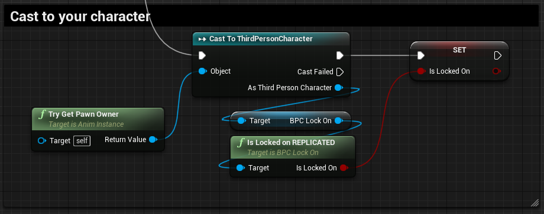
    <figcaption>Getting the lock-on info</figcaption>
    </figure>

The `BPC_LockOn` and `BPC_Target` components have also event dispatchers. They can be useful for various reasons. For example, you can use the `LockedOn` event to change your camera style to a combat style. There are a lot of possibilities. The images below show the event dispatchers. You can find them by clicking over the component and going on the details panel. The events are down below this panel with a green `+` symbol.

??? image "Event dispatchers"
    === ":material-function: `BPC_LockOn`"
        <figure markdown>
        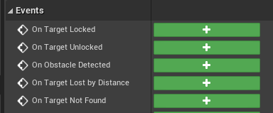{ align=right }
        <figcaption>Dispatchers on details panel</figcaption>
        </figure>
        <figure markdown>
        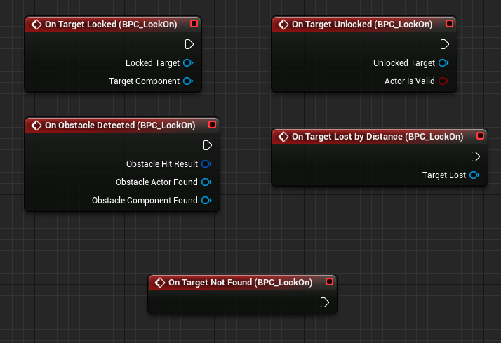{ align=left }
        <figcaption>Dispatchers called</figcaption>
        </figure>
    === ":material-function: `BPC_Target`"
        <figure markdown>
        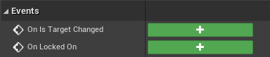{ align=right }
        <figcaption>Dispatchers on details panel</figcaption>
        </figure>
        <figure markdown>
        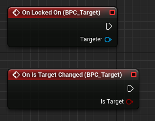{ align=left }
        <figcaption>Dispatchers called</figcaption>
        </figure>

## Variables
You can find the variables descriptions below. They have a tooltip in the project (to check there, just hover over the variable!).

??? abstract "Variables descriptions"
    === ":material-table: `BPC_LockOn component`"
        --8<-- "docs/codes/lock-on/lock-on-variables-table.txt"
    === ":material-table: `BPC_Target component`"
        --8<-- "docs/codes/lock-on/target-variables-table.txt"
    === ":material-table: `BPC_LockOnDebug component`"
        --8<-- "docs/codes/lock-on/debug-variables-table.txt"
    === ":material-table: `BPC_TargetReticleOverride component`"
        --8<-- "docs/codes/lock-on/target-reticle-variables-table.txt"

## Integration with external projects
LTS is very flexible. It can be used in many types of projects. One of the most popular project, the Advanced Locomotion System, is fully compatible with LTS. You can check how to integrate both in [this video](https://www.youtube.com/playlist?list=PLHdESzTufIOS8v6lpmFAojAq0arxGNomT).

## Previous versions
* [Version 3.0 documentation | :material-unreal: 4.24-4.25](https://sites.google.com/view/lockontargetingsystem)
* [Version 2.0 documentation | :material-unreal: 4.17-4.23](https://sites.google.com/view/lockontargetingsystem#h.zba6c1gskubb)

## Update log
**`2023/01:` version 4.0 released.**
??? info "4.0 news"
    * New input system, switch targets in any direction
    * Use the target component in any actor with collision
    * Multitargeting in one or more meshes and sockets
    * Target preview option
    * Softlock (call the `softlock` function)
    * Several useful functions
    * Performance improved
    * Easier to use
    * First/third person support
    * Splitscreen support
    * Top/down games support
    * Network support

`2021/09:` version 3.0 released.

`2020/09:` version 2.0 released.

`2020/05:` version 1.0 released.

## Questions and answers
??? question "I'm using the Advanced Locomotion System (ALS/ALSV3/ALSV4). Do you have any tutorials on integration of both systems?"
    Yes. You can check [this video](https://www.youtube.com/watch?v=Rbtlw64O0hA&ab_channel=A.) to setup the Lock-on Targeting System in the ALS project.

??? question "My target is not detected when I call the lock-on toggle event. Am I doing something wrong?"
    You need to check the following steps:

    1.  Make sure your target has the `BPC_Target` component.
    2.  Make sure your target has collision in at least one of its components.
    3.  Make sure that at least one of the collisions object types in the components of the target are included in the `BPC_LockOn` component, as showed in the [{==#Choosing sockets to lock-on==}](#choosing-sockets-to-lock-on) section.

??? question "My game is a first person game. Can I use this asset to lock-on?"
    Yes, you can. The setup process is identical to the third person, showed in this documentation ([{==#Getting Started==}](#getting-started)) and in the [tutorial video](https://youtu.be/pr8rlD5Ygtc). I just recommend that you mark the variable `bRotateCharacterAtTarget` as false, because your first person project probably already does that.

??? question "My game is a top down project or fixed camera project. Can I use this asset to lock-on?"
    Yes, you can. [Here is a video](https://youtu.be/zYj4zVBlftE?list=PLHdESzTufIOS8v6lpmFAojAq0arxGNomT) showing how you can do that. The basic ideia is to mark the variable `SearchTargetBaseDirection` of the `BPC_LockOn` component as `UseCharacterDirection`. 

??? question "My game is a platform game. Can I use this asset to lock-on?"
    Yes, you can. The setup process is similar to the question above, but in this case, mark the variable `bRotateCamera` as false. Also, if you want to lock-on targets behind your player, mark the variable `bConsiderOffscreenTargets` as true in the `LockOn` component reference.

??? question "My game is a splitscreen project. Can I use this asset to lock-on?"
    Yes, you can. This system includes native support for splitscreen projects.

??? question "My game is online. Can I used this asset to lock-on?"
    Yes, you can. This asset works with network games.

??? question "How can I lock-on targets behind my character?"
    Mark the variable `bConsiderOffscreenTargets` as true in the `LockOn` component reference.

??? question "I have multiple characters, and I need to possess more than one during the gameplay. How can I enable the lock-on performer on all of them?"
    You can add the `BPC_LockOn` component on all of them. But to have the lock-on settings working properly, you'll need to make quick mod in order to have the `LockOn point` being owned by all characters. You can [check here how to do this](https://youtu.be/kjpmZ8-u7JA). Also, I recommend calling the `Unlock` function before your possessing event, to avoid errors with player controller checking on non-possessed pawns.