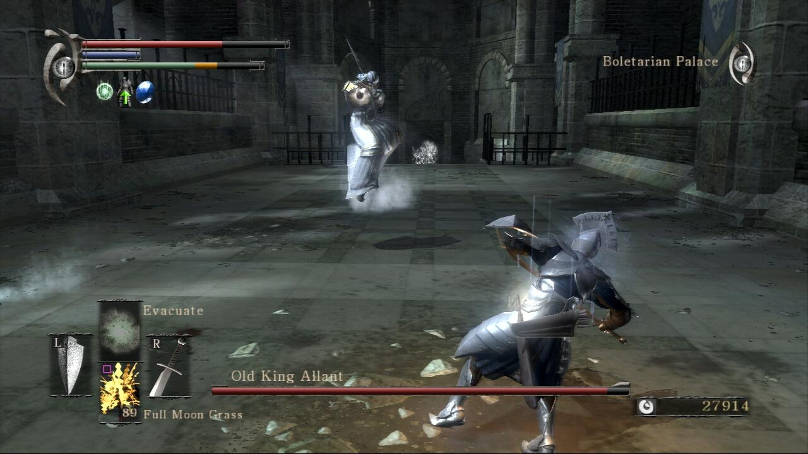
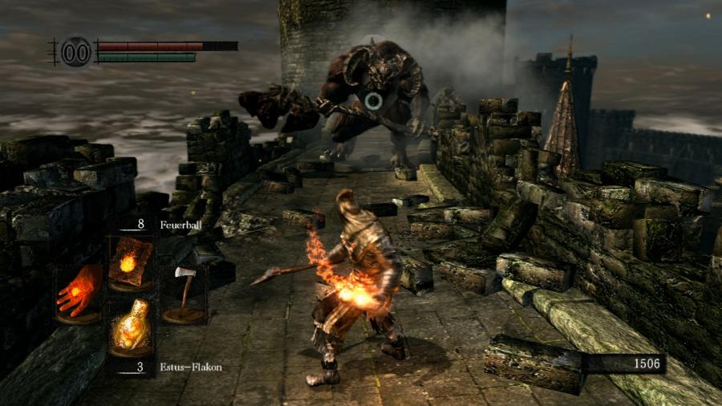
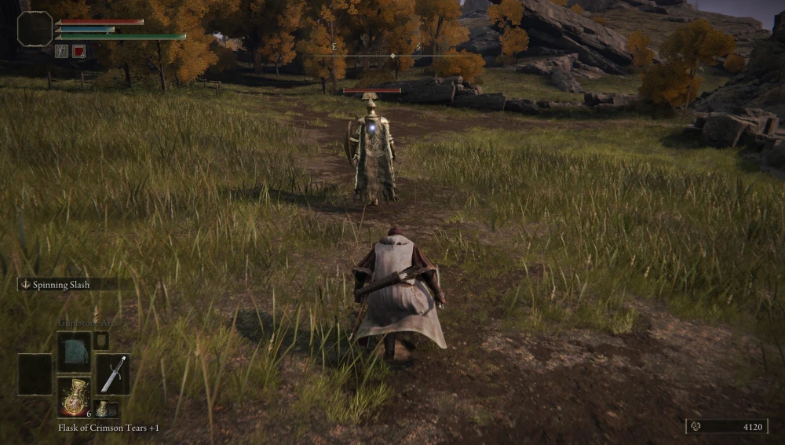
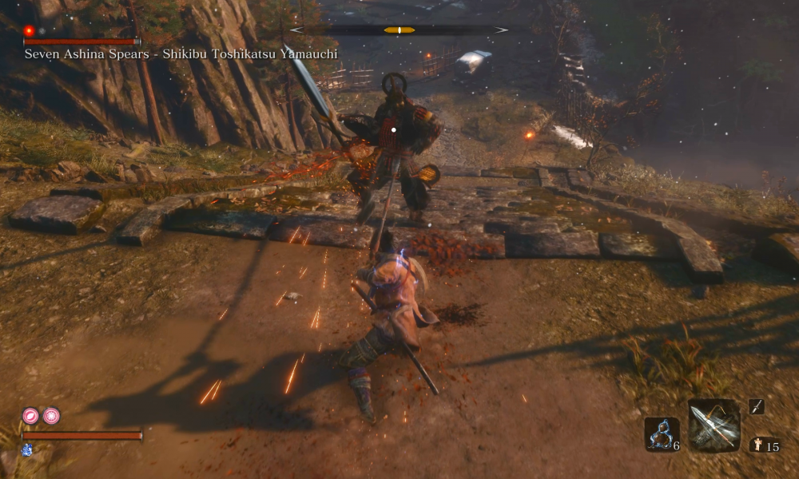
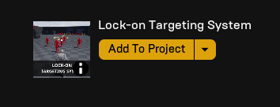

---
hide:
    - navigation
---
*[LTS]: Lock-on Targeting System

# Lock-on Targeting System V4

## Introduction
This project has been mainly influenced by souls series, specially Bloodborne.

=== "Bloodborne"
    

=== "Demon's Souls"
    

=== "Dark Souls"
    

=== "Elden Ring"
    

=== "Sekiro"
    

Built to be precise and highly customizable, this system has math at its core. With a quick and easy installation, you can use it in the most varied projects.

## Unreal library
First of all, download and add it to your project. You can find it in your [Unreal Engine Library](https://www.unrealengine.com/marketplace/en-US/product/lock-on-targeting-system).

<figure markdown>
  { width="300" }
  <figcaption>Unreal Engine Library</figcaption>
</figure>

## Setup

  <iframe width="459" height="312" align="right" src="https://www.youtube.com/watch?v=pr8rlD5Ygtc&list=PLHdESzTufIOS8v6lpmFAojAq0arxGNomT&index=2" frameborder="0" allowfullscreen></iframe>

You can check out [this video](https://youtu.be/pr8rlD5Ygtc) to watch the LTS setup, or follow the steps below. The main steps you'll check below are, in summary:

* Adding lock-on component
    * Setting up the input settings
* Adding target component
    * Setting up the sockets
* Extra components and tips
    * Debug
    * Reticle override
    * Customization

### Adding lock-on component

!!! warning "Collision detection"
    Make sure to choose the object collision type of your targets on the lock-on component variable [].

!!! Note "Variables and functions tooltips"
    All variables have a tooltip explaining what they do. To see it, just hover over the variable. The same is valid for any function: hover over the function or open it to see what it does.

### Adding target component

!!! warning "Component object collision type"
    Make sure the component you have chosen has some type of collision present on the lock-on component. Otherwise this socket will not be detected!

### Customization

### Lock-on component

### Target component

## Extra components

### Debug component

### Reticle override component

## Update log

## Previous versions

## Commands

* `mkdocs new [dir-name]` - Create a new project.
* `mkdocs serve` - Start the live-reloading docs server.
* `mkdocs build` - Build the documentation site.
* `mkdocs -h` - Print help message and exit.

## Project layout

    mkdocs.yml    # The configuration file.
    docs/
        index.md  # The documentation homepage.
        ...       # Other markdown pages, images and other files.

!!! warning "Phasellus posuere in sem ut cursus"
    
    Referências em: https://squidfunk.github.io/mkdocs-material/reference/admonitions/
    Lorem ipsum dolor sit amet, consectetur adipiscing elit. Nulla et euismod
    nulla. Curabitur feugiat, tortor non consequat finibus, justo purus auctor
    massa, nec semper lorem quam in massa.

#bloco expandido: usar ??? em vez de !!!, com um + na frente do ??? fica automaticamente expandido
???+ note "Phasellus posuere in sem ut cursus"
    
    Referências em: https://squidfunk.github.io/mkdocs-material/reference/admonitions/
    Lorem ipsum dolor sit amet, consectetur adipiscing elit. Nulla et euismod
    nulla. Curabitur feugiat, tortor non consequat finibus, justo purus auctor
    massa, nec semper lorem quam in massa.

<figure markdown>
  { width="300" }
  <figcaption>Image caption</figcaption>
</figure>

{ align=left, width="400" }