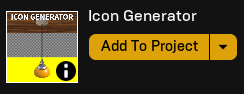
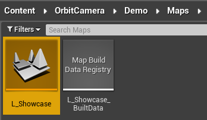
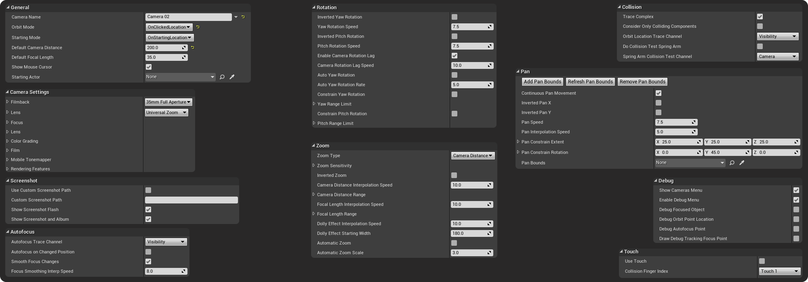
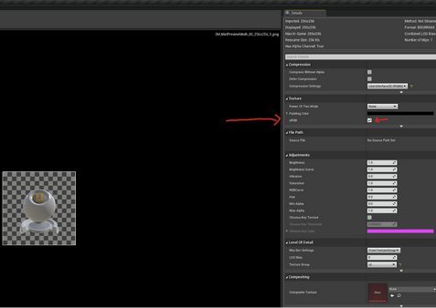
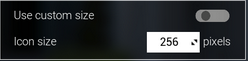

---
hide:
    - navigation

title: Orbit Camera
---

*[UE4]: Unreal Engine 4
*[UE5]: Unreal Engine 5

# ORBIT CAMERA | version 1.0
##### Last mod.: 2024-01

## Introduction
This asset enables the visualization of objects through orbital movement. You have the flexibility to choose the behavior: orbit under click location, around the object's center, or around its original pivot. The asset provides a range of variables for customization. Try the web demo at this [link](https://alexandrezlima.github.io/orbitcamerademo/) or download the Windows version for free at [this link](https://drive.google.com/file/d/15wPyf7BoVktPu3DqqN-iDd5KeHNA2Etk/view?usp=sharing).

## Getting started
### Unreal library
First of all, download and add it to your project. You can find it in your [Unreal Engine Library](https://google.com).

<figure markdown>
{ width="250" }
<figcaption>Unreal Engine Library</figcaption>
</figure>

### How to use
The orbit camera is a pawn class. That means it is controlled by a controller (any controller, you can use even the default controller, no need to setup it!).

Go to the `Content → OrbitCamera → Blueprints → BP_OrbitCamera`, drag and drop the `BP_OrbitCamera` your level and that's all.

<figure markdown>

<figcaption>Drag and drop the `BP_OrbitCamera`</figcaption>
</figure>

??? info "Testing the demo level"
	After adding the asset to your project, you can test it by opening the `L_Showcase` map. It can be found at: `Content → OrbitCamera → Demo → Maps`.

	<figure markdown>
	
	<figcaption>Orbit Camera map</figcaption>
	</figure>

	Once in the map level, you can hit play and try out 4 cameras in the level. They're all the same camera class with different settings (you can customize these settings by clicking over the camera and checking the details panel).

	<figure markdown>
	
	<figcaption>Orbit camera settings</figcaption>
	</figure>

### Screenshots and album

### Variables
You can find the variables descriptions below. All the variables have a tooltip in the project (to check there, just hover over the variable!).

??? abstract "Variables"
    --8<-- "docs/codes/orbitcamera/orbit-cam-variables.txt"

### Controls
The orbit camera has some input controls:

| 	`Key`     			| `Action/Description`
|	----------------:	| :----------------
|	Left mouse button 	| Click to focus on an object or point (if the orbit mode is `OnClickedLocation`, `OnObjectCenter` or `OnObjectPivot`)
|	Right mouse button	| Click and hold. Move the mouse to move the rotate the camera.
|	Middle mouse button	| Click and hold. Move the mouse to move the camera (pan).
|	Middle mouse button	| Double click. Set the focus under the mouse position in the world.
|	Middle mouse button	| Triple click. Remove the focus and set it to the default focus.
|	R 					| Resets the camera position (shortcut).

All the keys are customizable, you can change it to your own controls and adapt it to use with touch devices (for this case, check the touch section).

### Update log
**`2024/02:` version 1.0 launch.**

### Questions and Answers

??? question "I would like to try this asset. Do you have any demo available?"
	Yes! You can try this asset directly in your browser at this [link](https://alexandrezlima.github.io/orbitcamerademo/) or you can download the Windows version at [this link](https://drive.google.com/file/d/15wPyf7BoVktPu3DqqN-iDd5KeHNA2Etk/view?usp=sharing). This demo brings a debug menu where you can test a lot of customization options at runtime that are available in the asset. The web demo version doesn't supoport high resolution screenshots and the blur effects are reduced compared to the desktop version.

??? question "Can I have more than one camera in my level?"
	Yes, you can have multiple orbit cameras in your level. For example, you can setup multiple cameras to view different points of an object. You can limit the movement and rotation of each camera individually.
	
	That means you need to set the scalability option `Effects` to `Cinematic`. [Here is a video showing how you can do it](https://youtu.be/JbM5bPsHho4). If you downloded Icon Generator from your Unreal Engine library after 2023-06-01, the asset code changes this scalability setting automatically (and brings the original value back to default after closing the level).

??? question "Every time I close the Icon Generator on Unreal Engine 5.1, it loads some shaders again. Why does this happen? There is a way to avoid this?"
	This happens because of the previous question: UE5.1 introduced an issue where the alpha composite appears only if the `Effects` quality is set to `Cinematic` (and, in some computers, `Epic` quality is enough).
	
	So the project in UE5.1 changes it to “Cinematic” automatically when you hit play, and turns it back to its default when closing. To avoid the shaders recompiling, [you can try this](https://youtu.be/JbM5bPsHho4) (setting to `cinematic`) and the loading will happen only once, as it will be changed from `cinematic` to `cinematic` (so no changes to be compiled).

??? question "I’m using the `Import textures to the project` function/toggle. When I use the texture generated on a widget, it looks washed. How can I fix this?"
	When the Unreal Editor generates the texture (in this case, specifically the importing function and not the export one), for some reason the “sRGB” checkbox is marked as false by default, so the color looks washed because of that (even if I set it to sRGB true in the code, the color will show up washed, that’s why the following process needs to be done manually).
	
	So, to fix it, you need to mark the `sRGB checkbox` as `true` in the texture details panel. If you have more than one texture, it is possible to do it all at once – the documentation video shows how to do that (or you can check the [{==#washed-colors-correction==}](#washed-colors-correction) section), starting at 5min 22s ([this link](https://www.youtube.com/watch?v=gOroSCY0eSc&list=PLHdESzTufIORQ6LbFutzgkbN-bDREGU8M&t=321s&ab_channel=A.)).

	<figure markdown>
	
	<figcaption>sRGB</figcaption>
	</figure>

??? question "This asset can create textures with custom size?"
	Yes! You just need to mark the `custom size` toggle as `true` and an extra box will show up to insert the custom size.

	<figure markdown>
	{ width=250 align=left }
	{ width=244.05 align=right }
	<figcaption>Custom size toggle</figcaption>
	</figure>

??? question "I’m trying to export my texture using the Export toggle option, but the texture is not being generated (it says “done” but I can’t find it)."
	For an odd reason some projects do not allow you to generate a new folder within the Project/Saved folder. By default the Icon Generator saves your exported icons within the Project/Saved/Icons folder (it creates a new folder within Project/Saved).

	If you're getting this issue, I recommend that you change the default output path in the `Output file path` field. As example, you can set the value as `C:\Users\YourUser\Downloads\ExampleFolder`. Any valid path can be used to export icons!

??? question "I’m trying to import my texture using the Import toggle option, but the texture is not being generated (it says “done” but I can’t find it)."
	Only `power of two` can be imported using the `Import toggle` (unfortunately I can’t change this, it is an internal function of the Unreal Engine).

	These are valid icon sizes:  16x16, 32x16, 2048x1024, etc.

	And these are invalid icon sizes: 79x16, 34x34, 2000x1000, 32x25, etc.

	In summary, the numbers must be $2^n$. Examples:
	
	*	$2^4 = 16$
	*	$2^5 = 32$
	*	$2^6 = 64$
	*	$2^7 = 128$
	* 	$...$

	So these are valid power of two sizes, defined by $2s$ x $2t$, where $s$ and $t$ are positive integer numbers.

??? question "How can I increase the bulk delay per object? The current time is not enough to load the textures on my machine."
	You can increase the float variable `bulk delay per mesh` of the `UI_ObjectRender` widget. Take a look at the [{==#bulk-icons==}](#bulk-icons) section for more details about increasing the bulk delay.

??? question "I get an error when spawning my blueprint and closing the icon generator level."
	You’ll get red errors only if your blueprint depends on any reference that is not in the level. For example, if your blueprint needs the reference of a specific actor (let’s say a health potion blueprint needs the player_character_3 reference), as the actor is not in the level, the reference will be null, so if the blueprint needs that reference in any point, it will show you an error. In any case, you don’t need to edit your blueprints, the error will not cause you any problems to generate the icons (of course, as long as its visual is not dependent on other actors).