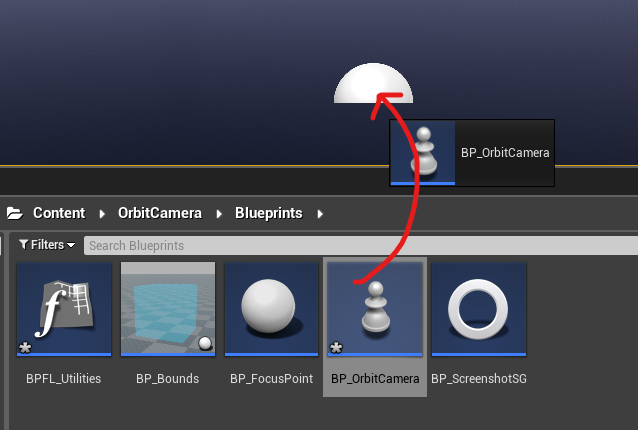

---
hide:
    - navigation

title: Orbit Camera
---

*[UE4]: Unreal Engine 4
*[UE5]: Unreal Engine 5

# ORBIT CAMERA | version 1.0
##### Last mod.: 2024-01

## Introduction
This asset enables the visualization of objects through orbital movement. You have the flexibility to choose the behavior: orbit under click location, around the object's center, or around its original pivot. The asset provides a range of variables for customization. Try the web demo at this [link](https://alexandrezlima.github.io/orbitcamerademo/) or download the Windows version for free at [this link](https://drive.google.com/file/d/1VqFKOF9S8F1EqYrwe4Jgqu0m4yUJFgNC/view?usp=sharing).

## Getting started
### Unreal library
First of all, download and add it to your project. You can find it in your `Unreal Engine Library`.

### How to use
The orbit camera is a pawn class. That means it is controlled by a controller (any controller, you can use even the default controller, no need to setup it!).

Go to the `Content → OrbitCamera → Blueprints → BP_OrbitCamera`, drag and drop the `BP_OrbitCamera` into your level and that's all, after hitting play you'll control the orbit camera.

<figure markdown>

<figcaption>Drag and drop the `BP_OrbitCamera`</figcaption>
</figure>

You may want to customize the orbit camera settings. The process to edit it is very simple: click over the orbit camera in the world, go to the details panel and you'll notice a lot of exposed variables to customize.

<figure markdown>

<figcaption>Orbit camera settings</figcaption>
</figure>

Each variable has a tooltip with a description that tells you what it does (hover the mouse cursor over the variable). If you want to test most of the variables at runtime, make sure to mark the variable `bEnableDebugMenu` as `True` and a menu will show up after you hit play.

<figure markdown>

<figcaption>Debug menu</figcaption>
</figure>

With this menu you can change the settings at runtime and check how it impacts in the camera behavior. Take your time and tweak it!

??? info "Testing the demo level"
	After adding the asset to your project, you can test it by opening the `L_Showcase` map. It can be found at: `Content → OrbitCamera → Demo → Maps`.

	<figure markdown>
	
	<figcaption>Orbit Camera map</figcaption>
	</figure>

	Once in the map level, you can hit play and try out 4 cameras in the level. They're all the same camera class with different settings (you can customize these settings by clicking over the camera and checking the details panel).

	<figure markdown>
	
	<figcaption>Orbit camera settings</figcaption>
	</figure>

#### Orbit mode
The main option in this asset is the orbit mode, found in the `OrbitMode` variable in the `BP_OrbitCamera` blueprint. You have four options: `OnClickedLocation`, `OnObjectCenter`, `OnObjectPivot`, `OnStartLocationOnly`.

* `OnClickedLocation`: the camera will orbit the clicked (or touch, check the [{==#Touch==}](#Touch-setup) section) point. Surfaces are recognized if they have a collision response corresponding to the type specified in the `OrbitLocationTraceChannel` variable. By default, this channel is set to `Visibility`. In the demo map, for example, the floor is marked to ignore `Visibility` trace channels and the objects in the level are marked to block this channel.

* `OnObjectCenter`: the camera will orbit the object's center. Imagine a box in which your object fits perfectly in terms of height, width, and length. The center of the object will be the center of this imaginary box. You can visualize this imaginary box by toggling the 'bDebugFocusedObject' variable to `True`, either in the variables panel or directly in the debug menu widget.
<figure markdown>
{ width=300 }
<figcaption>Debugging object bounds</figcaption>
</figure>

* `OnObjectPivot`: the camera will orbit around the object's pivot. Note that the pivot may coincide with the center of the object or not.

* `OnStartLocationOnly`: the camera will orbit the starting point, and it won't move to a different point.

#### Starting mode
The starting mode can help you align the camera initially. This variable (`StartingMode`, available in `BP_OrbitCamera`) can be combined with the `StartingActor` variable (available in the same blueprint) to focus on the center or pivot of a specific object.

<figure markdown>

<figcaption>Starting mode: first, set the starting mode (1); click over the picker (2); select the object to focus (3).</figcaption>
</figure>

### Touch setup
This asset can be used with touch devices. You'll need, however, setup some keys and settings as follows:

#### 1. Enabling gestures
To use gestures like pinch, we need to enable the gesture recognizer in the project settings. To do this, click on `Edit → Project Settings` at the top bar. Search `gesture` and mark `EnableGestureRecognizer` as `True`.

<figure markdown>

<figcaption>Project settings: gestures</figcaption>
</figure>

#### 2. Touch in BP_OrbitCamera
Open the `BP_OrbitCamera`. In the variables panel, mark `bUseTouch` as `True`. This ensures that the touch input will be used in the trace channels events.

#### 3. Using touch
With these two settings, you will be able to use touch on supported devices such as mobiles. Using a two-finger **pinch** motion, you can zoom in and out. With **two taps** on the screen, you can focus on an object or a point. You can rotate either by **swiping** a finger on the screen or using the **right analog stick**. Finally, you can move the camera (pan) using the **left analog stick**.

### Screenshots and album
You can take screenshots using the `P` key or the `Screenshot` button at the bottom center of the screen. You can check all the photos taken in the album by pressing `G` or the `Album` buttom at the bottom center of the screen.

It is possible to customize it as well by editing the `W_ScreenshotAndAlbum` widget or editing the keys in the `BP_OrbitCamera` blueprint (at `Content → OrbitCamera → Blueprints` folder).

You can edit both screenshot path and resolution. To edit the path, make sure to mark `bCustomScreenshotPath` variable as `True`. Then, you can set the custom path in two ways: 
	1) call the function `SetScreenshotPath` (for example in the begin play node) and pass your path as a parameter; 
	or
	2) set the `CustomScreenshotPath` string variable with your custom path.

To edit the resolution open the `GetScreenshotResolution` function in the `BP_OrbitCamera` blueprint and edit the resolution return. By default, the screenshot resolution is the same as your application window size.

### Variables
You can find the variables descriptions below. All the variables have a tooltip in the project (to check there, just hover over the variable!).

??? abstract "Variables"
    --8<-- "docs/codes/orbitcamera/orbit-cam-variables.txt"

### Controls
The orbit camera has some input controls:

| 	`Key`     			| `Action/Description`
|	----------------:	| :----------------
|	Left mouse button 	| Click to focus on an object or point (if the orbit mode is `OnClickedLocation`, `OnObjectCenter` or `OnObjectPivot`)
|	Right mouse button	| Click and hold. Move the mouse to move the rotate the camera.
|	Middle mouse button	| Click and hold. Move the mouse to move the camera (pan).
|	Middle mouse button	| Double click. Set the focus under the mouse position in the world.
|	Middle mouse button	| Triple click. Remove the focus and set it to the default focus.
|	R 					| Resets the camera position (shortcut).
|	P 					| Takes a screenshot and saves it in the album.
|	G 					| Opens the album.

All the keys are customizable, you can change it to your own controls by editing the `BP_OrbitCamera` blueprint. You can also adapt it to use with touch devices (for this case, check the touch section for instructions).

### Update log
**`2024/02:` version 1.0 launch.**

### Questions and Answers

??? question "I would like to try this asset. Do you have any demo available?"
	Yes! You can try this asset directly in your browser at this [link](https://alexandrezlima.github.io/orbitcamerademo/) or you can download the Windows version at [this link](https://drive.google.com/file/d/15wPyf7BoVktPu3DqqN-iDd5KeHNA2Etk/view?usp=sharing) (WebGL application for html5, this is not a streaming project). This demo brings a debug menu where you can test a lot of customization options at runtime that are available in the asset. The web demo version doesn't supoport high resolution screenshots and the blur effects are reduced compared to the desktop version.

??? question "Can I have more than one camera in my level?"
	Yes, you can have one or multiple orbit cameras in your level. For example, you can setup multiple cameras to view different points of an object. You can limit the movement and rotation of each camera individually.

	To control the first possessed camera, make sure to click over your secondary cameras, go to the details panel and mark `Auto Possess Player` as `Disabled`.

	If you want to be able to switch over multiple cameras at runtime using buttons in a menu, mark the `bShowCamerasMenu` variable as `True` in the `BP_OrbitCamera` blueprint. A menu will show up with your multiple cameras (feel free to edit its appearance in the `W_Cameras` widget at `Content → OrbitCamera → Widgets` folder). You can edit their names in the `CameraName` variable in the details panel of each camera (this name will be displayed in the widget).

??? question "Can I choose a different path for my screenshots?"
	Yes, you can. First, make sure to mark `bCustomScreenshotPath` variable as `True`. Then, you can set the custom path in two ways: 
	
	1) call the function `SetScreenshotPath` (for example in the begin play node) and pass your path as a parameter; 
	or
	2) set the `CustomScreenshotPath` string variable with your custom path.

??? question "Can I increase the screenshot resolution?"
	Yes, you can increase the screenshot resolution. Open the `GetScreenshotResolution` function in the `BP_OrbitCamera` blueprint and edit the resolution return. By default, the screenshot resolution is the same as your application window size.

	<figure markdown>
	
	<figcaption>Screenshot resolution</figcaption>
	</figure>